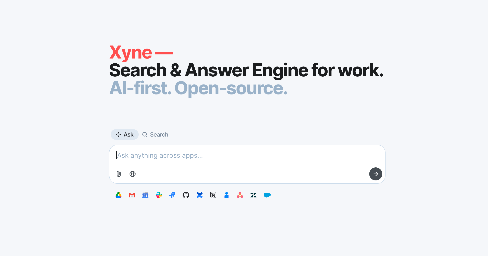

<p align="center">
  <a href="https://github.com/xynehq/xyne/releases/latest">
    
  </a>
  <a href="https://opensource.org/licenses/Apache-2.0">
    
  </a>
  <a href="https://join.slack.com/t/xynerds/shared_invite/zt-34w0oz03a-BkG~YzkkSZ~T8PzoZti7lA">
    
  </a>
</p>

Xyne is an AI-first Search & Answer Engine for work. We’re an OSS alternative to Glean, Gemini and MS Copilot.

Your work information has become fragmented — across so many SaaS apps, docs, files, repos, projects, issues, emails, messages, tickets, etc. Xyne connects to your applications (Google Workspace, Atlassian suite, Slack, Github, etc), securely indexes your data, and maps a graph of relationships. So you get a (Google + ChatGPT) like experience to find anything across it all and get up-to-date answers with sources. 

Find that file, triage that issue, ask everything about a customer / deal / feature / ticket, discover the right people. I.e. Get the right information quickly to move your work forward.

We already have intelligent AI models. What's missing to make them work at your work is providing them with your context. In a secure, private and responsible manner. That's what Xyne does.

Xyne is the most secure & future-proof solution to bring AI into your work and your org.

You can check out our [documentation](https://docs.xynehq.com) to learn more about Xyne.

### Live now on entire Google Workspace

So you can ask and search anything across not just your drive, PDFs, docs, sheets, slides; but also your calendar, contacts, gmail — including all your attachments! 

When most Enterprise Search solutions say Google Worksuite integration, they generally mean drive (and conveniently skip contacts, calendar, and gmail).

**NEXT: Slack and Atlassian integrations**

## ✨ Features

- **Self-hosted**: Deploy anywhere - laptop, on-prem, cloud.
- **Model Agnostic**: Plugs into any LLM of your choice. Also
via any cloud provider of your choice. You can even point it
to a local Deepseek via ollama.
- **Private & secure**: No training on your data or prompts. No
telemetry.
- **Permissions-aware**: Live enforcing of your apps' existing
permissions; no one sees what they don't have access to.
- **High performance**: Multi Threaded data ingestion

## 📺 Demos

AI Search and Answer engine for Work

[](https://www.youtube.com/watch?v=ZvyRp4o_p-0)

DeepSeek over internal data

[](https://www.youtube.com/watch?v=rl5J-DeHG04)

## 💻 Setting up Google Workspace integration
Follow the steps mentioned for the [Service Account integration](https://docs.xynehq.com/authentication/service-accounts) of Google Workspace

## 🚀 Deployment

Xyne can be easily run locally or deployed on a virtual machine using a single ```docker-compose``` command.

#### To run Xyne locally:
To run xyne locally on your machine, check out the [Quickstart](https://docs.xynehq.com/quickstart) section in our docs.

#### To run Xyne in your Cloud Provider:
To run Xyne on AWS EC2, check out the [Cloud Deployment](https://docs.xynehq.com/deployment/cloud/aws/aws-deployment-with-docker) section in our docs.

## 💪🏻 Building the most open, modular, extensible Work AI Platform

What augments humans with the right context also augments LLMs (AI Agents / Assistants) with retrieval, memory, and tooling. That's the platform we're building. An Org Operating System (OrgOS) that provides you with the right tooling to build AI-first internal applications and workflows tailored to your & your team's requirements.

## ✒️  Contribute to Xyne
If you want to contribute to Xyne, checkout our [Contribution Guide](https://docs.xynehq.com/contribution/contribute) for more details.