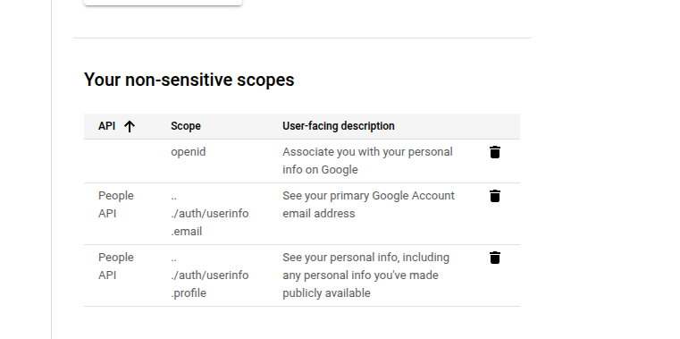

Follow the instructions below to generate your google credentials : 

## Setting up a project in Google Cloud Console
Create a new project in [Google Cloud Console](https://console.cloud.google.com/projectcreate) 


Switch to the new project you just created.

## Setting up the OAuth Credentials
Under APIs and Services section in the menu on the sidebar, click on ```Credentials```,


- Navigate to the Credentials Section in the sidebar, and click on  ```+CREATE CREDENTIALS ```. It will ask you to create oauth consent screen, for this you can refer to [the consent screen](https://docs.xynehq.com/authentication/oauth#setting-up-the-oauth-consent-screen). 
For now in the scope section only add ```/auth/userinfo.email```,```/auth/userinfo.profile``` and ```openid```, leave out the rest of it.



<Tip> With this you will now be able to successfully login to Xyne with your google account.</Tip>

- Under that select the ```OAuth client ID``` option. 


- Add the type as ```Web Application```, and give it a name (For ex: Xyne)


- Add Authorized JavaScript origins as:
    - ```http://localhost:3001``` for local or replace with ```http://<YOUR_AWS_EC2_IPv4_DNS>``` for production.

- Add Authorized redirect URIs as:
    - ```http://localhost:3001/v1/auth/callback``` for local setup or ```https://<YOUR_AWS_EC2_IPv4_DNS>/v1/auth/callback``` for production.
    - ```http://localhost:3001/oauth/callback``` for local setup or ```https://<YOUR_AWS_EC2_IPv4_DNS>/oauth/callback``` for production.

<Note> Use ```http://localhost:3000/v1/auth/callback``` and ```http://localhost:3000/oauth/callback``` when using devmode.</Note>

Click ```CREATE``` and make sure to save the Client ID and Client Secret for putting it in the [```.env``` of the application](https://docs.xynehq.com/quickstart#server-side)


