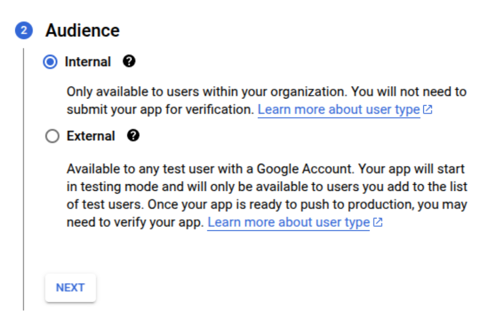
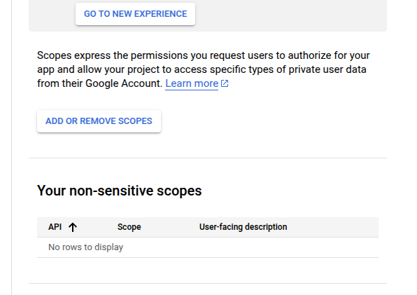

Follow the instructions below to generate your google credentials : 

## Setting up a project in Google Cloud Console
Create a new project in [Google Cloud Console](https://console.cloud.google.com/projectcreate) 


Switch to the new project you just created.

## Setting up the Oauth Consent Screen: 

<Tip> For a completely new project you will need to setup the consent screen before setting the credentials.</Tip>

First step after creating the project is to setup the OAuth Consent Screen. 
For this navigate to the OAuth Consent Screen in the Sidebar of your Google Cloud Console : 


Under ```OAuth Consent``` screen select ```Internal``` : 


<Tip> If you're using personal email, you can choose ```External```.</Tip>

Click on ```Create```

Under the ```App Information``` Section, fill out the details :
 - Provide a Name for the app (For ex: Xyne)
 - Provide a User Support email (For ex: your-email@gmail.com)
 - Upload an App Logo (if needed)
 - Put your domain under ```Authorized``` domain (You can choose to go ahead with your localhost or AWS IP Address)
 - Add Developer contact information (For ex: your-email@gmail.com)

 Click ```Save and Continue```

 Under the ```Scopes``` section you'll see the ```Add or Remove Scopes``` button. Click on that: 

<Tip> If you're going for OAuth Authentication you can set all the scopes using this part of the [OAuth Authentication Guide](https://docs.xynehq.com/authentication/oauth#adding-the-scopes-for-the-enabled-apis). 
If not you can add the scopes mentioned below. </Tip>
For now in the scope section only add ```/auth/userinfo.email```,```/auth/userinfo.profile``` and ```openid```, leave out the rest of it.


Leave the next page ,i.e. ```Test users``` blank.
<Tip> In case you're using your `personal email`, and you chose ```External``` then specify the external email in the Test User's section otherwise leave it blank.  </Tip>

This concludes the setting-up of your OAuth Consent Screen

## Setting up the OAuth Credentials
Now, under APIs and Services section in the menu on the sidebar, click on ```Credentials```,


- Navigate to the Credentials Section in the sidebar, and click on  ```+CREATE CREDENTIALS ```. 

- Under that select the ```OAuth client ID``` option. 


- Add the type as ```Web Application```, and give it a name (For ex: Xyne)


- Add Authorized JavaScript origins as:
    - ```http://localhost:3001``` for local or replace with ```http://<YOUR_AWS_EC2_IPv4_DNS>``` for production.

- Add Authorized redirect URIs as:
    - ```http://localhost:3001/v1/auth/callback``` for local setup or ```https://<YOUR_AWS_EC2_IPv4_DNS>/v1/auth/callback``` for production.
    - ```http://localhost:3001/oauth/callback``` for local setup or ```https://<YOUR_AWS_EC2_IPv4_DNS>/oauth/callback``` for production.

<Note> Use ```http://localhost:3000/v1/auth/callback``` and ```http://localhost:3000/oauth/callback``` when using dev-mode.</Note>

Click ```CREATE``` and make sure to save the Client ID and Client Secret for putting it in the [```.env``` of the application](https://docs.xynehq.com/quickstart#setting-the-environment-variables)


<Tip> With this you will now be able to successfully login to Xyne with your google account.</Tip>