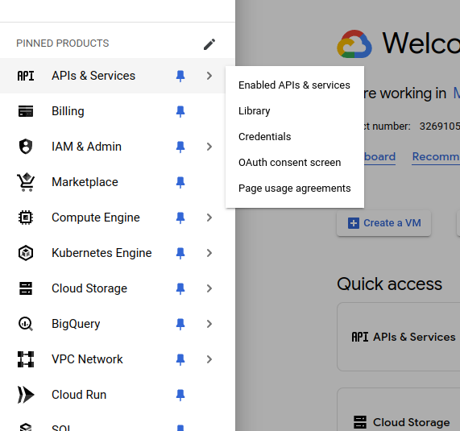
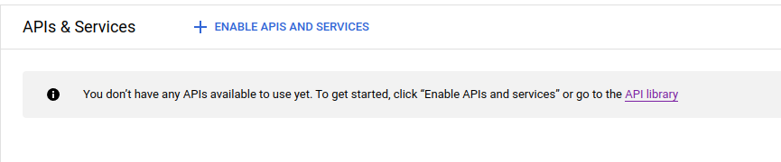
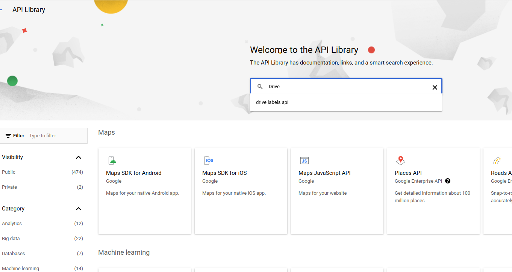
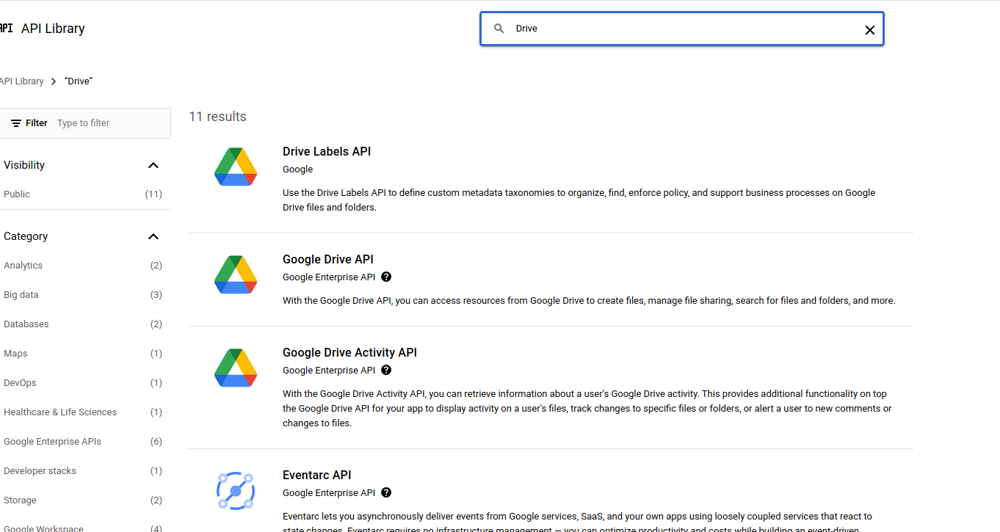
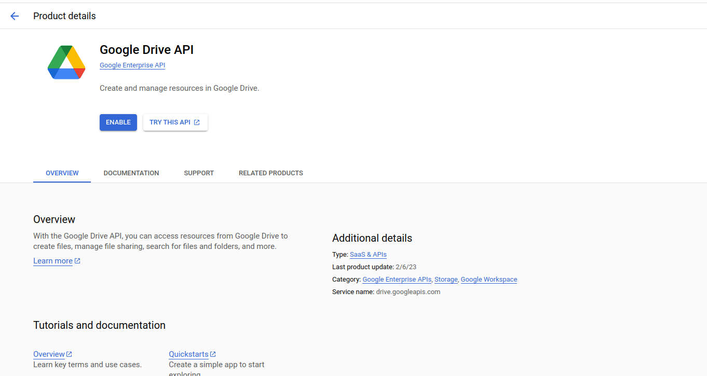
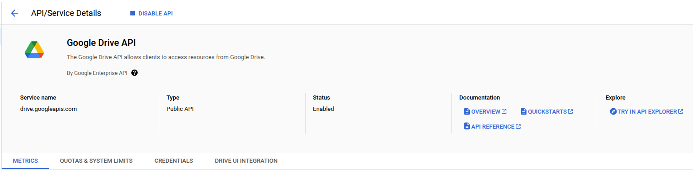
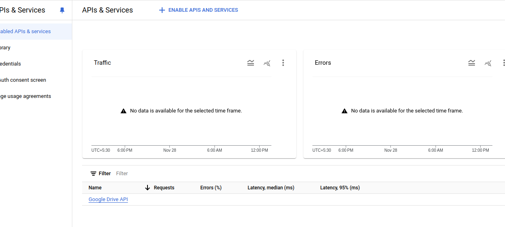
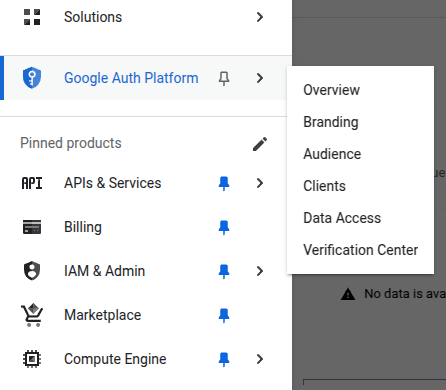
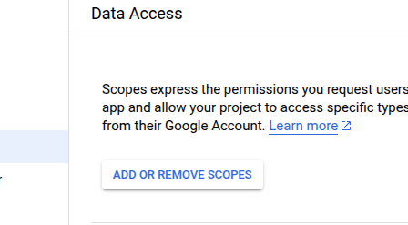
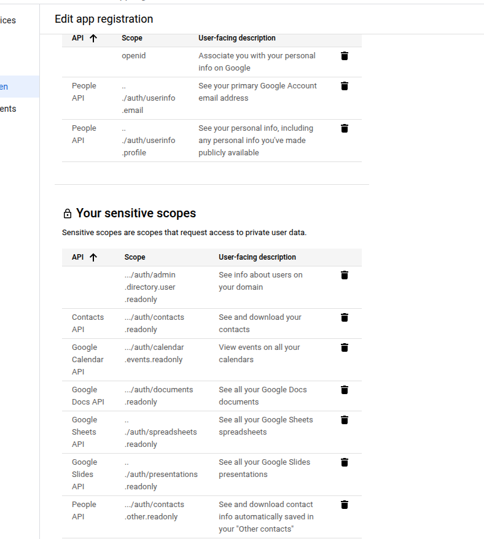

This guide assumes you've already configured your google credentials, incase you haven't follow the guide below to first do that :

<Card
  title="Setup Google Credentials"
  icon="google"
  href="/authentication/get-credentials"
>
Setup your Google Credentials for the application.
</Card>


## Enabling APIs
Switch to the new project you just created.


The first step is to enable the APIs which are needed for the app.
- From the menu in the side bar, under APIs and Services section select the ```Enabled APIs & Services```.

- In the ```Enabled APIs & Services``` page, click on the ```+ Enable APIs & Services```.

- You will now see a search box where you can search for the specific API that you want to enable. (For example :  Google Drive API)

- Once you search for an API, you will find a list of APIs. 

- From the list of APIs, select the Google Drive API to enable. And then click on ```Enable``` in the API page.

- Once the API is enabled, you will see that a ```DISABLE API``` button appears on top of the page.

- When you go back to the ```Enabled APIs & Services``` page, you will see that the enabled API has appeared in the list.


Following the same steps above, enable the following APIs : 
 - [Google Drive](https://console.cloud.google.com/apis/library/drive.googleapis.com)
 - [Google Calendar](https://console.cloud.google.com/apis/library/calendar-json.googleapis.com)
 - [Google Slides](https://console.cloud.google.com/apis/library/slides.googleapis.com)
 - [Google Docs](https://console.cloud.google.com/apis/library/docs.googleapis.com)
 - [Google Sheets](https://console.cloud.google.com/apis/library/sheets.googleapis.com)
 - [Gmail](https://console.cloud.google.com/apis/library/gmail.googleapis.com)
 - [Contacts](https://console.cloud.google.com/apis/library/contacts.googleapis.com)
 - [People](https://console.cloud.google.com/apis/library/people.googleapis.com)

<Warning> Please make sure to **enable all** the APIs listed above to ensure the Xyne app runs smoothly. </Warning>

## Adding the scopes for the Enabled APIs:
- From the menu on the left-side, navigate to ```Google Auth Platform```. And under that, navigate to ```Data Access``` section.


- Along with the scopes you had added before, add the rest of scopes for the enabled apis, using the ```ADD OR REMOVE SCOPES``` button.



- Ensure to select the checkbox for all of these scopes [you can use these values in the searchbox for the scopes table] : 
  - ```/auth/drive.readonly```
  - ```/auth/documents.readonly```
  - ```/auth/spreadsheets.readonly```
  - ```/auth/presentations.readonly```
  - ```/auth/contacts.readonly```
  - ```/auth/contacts.other.readonly```
  - ```/auth/gmail.readonly```
  - ```/auth/calendar.events.readonly```

  You can also choose to ```manually``` add the scopes in the ```box``` below.

  ```javascript
    https://www.googleapis.com/auth/drive.readonly,
    https://www.googleapis.com/auth/documents.readonly,
    https://www.googleapis.com/auth/spreadsheets.readonly,
    https://www.googleapis.com/auth/presentations.readonly,
    https://www.googleapis.com/auth/contacts.readonly,
    https://www.googleapis.com/auth/contacts.other.readonly,
    https://www.googleapis.com/auth/gmail.readonly,
    https://www.googleapis.com/auth/calendar.events.readonly,
  ```

Click on ```ADD TO TABLE```, and then ```UPDATE```. You will now be able to see all the added scopes in the tables below: 



Then click on ```SAVE``` .

This concludes the set-up process of Google OAuth.


