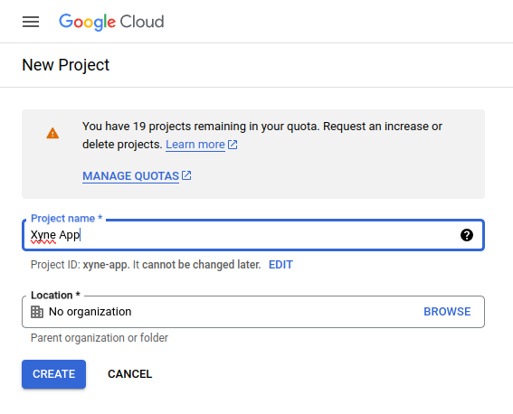
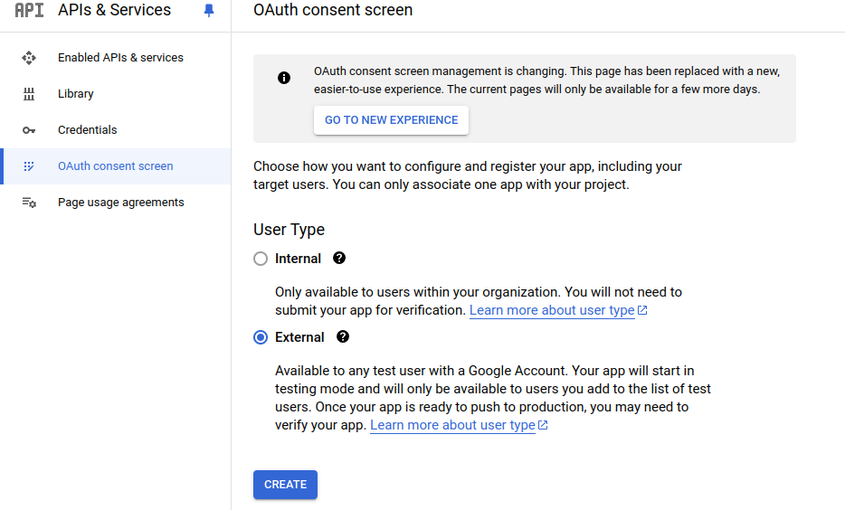
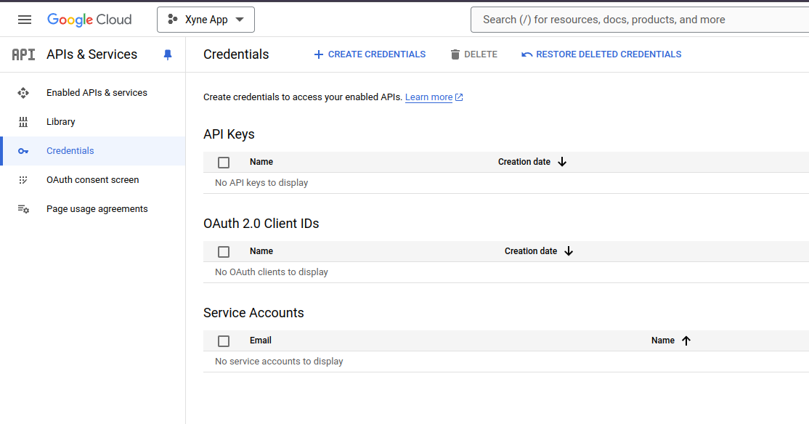
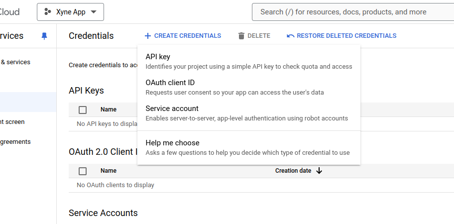
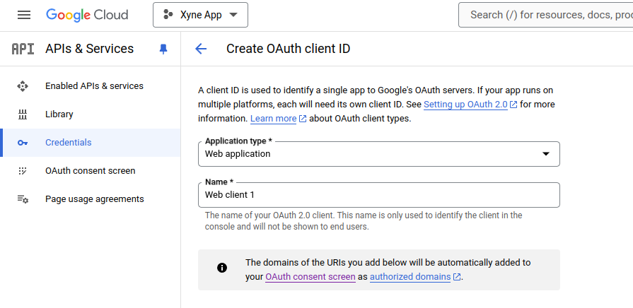

## Setting up a project in Google Cloud Console
Create a new project in [Google Cloud Console](https://console.cloud.google.com/projectcreate) 



### Setting up the Oauth Consent Screen
Navigate to the Oauth Consent Screen in the Sidebar of your Google Cloud Console : 


Under ```OAuth Consent``` screen select either Internal or External, depending on your requirement : 

 - Since you're have a Google Workspace, you should choose ```Internal```
Click on ```Create```


Under the ```App Information``` Section, fill out the details :
 - Provide a Name for the app (For ex: Xyne)
 - Provide a User Support email (For ex: your-email@gmail.com)
 - Upload an App Logo (if needed)
 - Put your domain under ```Authorised``` domain (You can choose to go ahead with your localhost or AWS IP Address)
 - Add Developer contact information (For ex: your-email@gmail.com)

 Click ```Save and Continue```

Under the ```Scopes``` section, you can choose to add the basic scopes ,
 - ```.../auth/userinfo.email``` 
 - ```.../auth/userinfo.profile```
 - ```openid```

Leave the next page ,i.e. ```Test users``` blank.
This concludes the setting-up of your Oauth Consent Screen

### Setting up the OAuth Credentials
Furthermore Under APIs and Services section,

- Navigate to the Credentials Section in the sidebar, and click on  ```+CREATE CREDENTIALS ```. 
Under that select the ```OAuth client ID``` option. 


- Add the type as ```Web Application```, and give it a name (For ex: Xyne)


- Add a Authorized JavaScript origins as:
    - ```http://localhost:3000``` for local or replace with ```http://<YOUR_AWS_EC2_IPv4_DNS>``` for production.

- Add a Authorized redirect URIs as:
    - ```http://localhost:3000/V1/auth/callback``` for local setup or ```https://<YOUR_AWS_EC2_IPv4_DNS>/v1/auth/callback``` for production.

Click ```CREATE``` and make sure save the Client ID and Client Secret for putting it in the [```.env``` of the application](https://xyne.mintlify.app/deployment/aws/aws-deployment#setup-environment-variables)


## Enabling APIs
The last step is to enable the APIs is needed for the app.
- From the menu in the side bar, under APIs and Services section select the ```Enabled APIs & Services```.

- In the ```Enabled APIs & Services``` page, click on the ```+ Enable APIs & Services```.

- You will now see a search box where you can search for the specific API that you want to enable. (For example :  Google Deive API)

- Once you search for an API, you will find a list of APIs. 

- From the list of APIs, select the API that you want to enable. And then click on ```Enable``` in the API page.

- Once the API is enabled, you will see that the Enable button noe changes to Manage. This means that the API has been enabled.

- When you go back to the ```Enabled APIs & Services``` page, you will see that the enabled API has appeared in the list.


Following the same steps above, enable the following APIs : 
 - [Google Drive](https://console.cloud.google.com/apis/library/drive.googleapis.com)
 - [Google Calendar](https://console.cloud.google.com/apis/library/calendar-json.googleapis.com)
 - [Google Slides](https://console.cloud.google.com/apis/library/slides.googleapis.com)
 - [Google Docs](https://console.cloud.google.com/apis/library/docs.googleapis.com)
 - [Google Sheets](https://console.cloud.google.com/apis/library/sheets.googleapis.com)
 - [Gmail] (https://console.cloud.google.com/apis/library/gmail.googleapis.com)
 - [Contacts](https://console.cloud.google.com/apis/library/contacts.googleapis.com)
 - [People](https://console.cloud.google.com/apis/library/people.googleapis.com)


This concludes the set-up process of Google Oauth.


