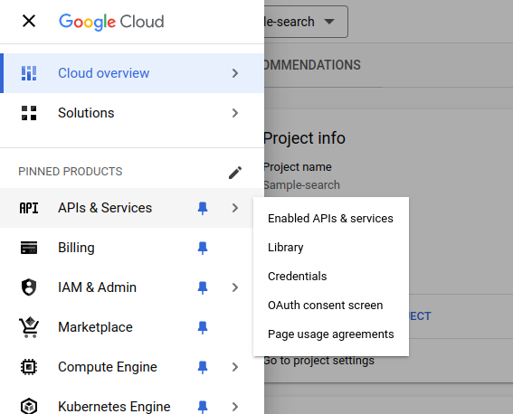
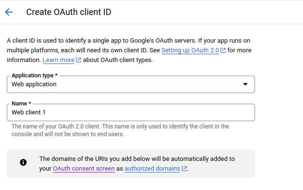

## Setting up a project in Google Cloud Console
Create a new project in (Google Cloud Console)[https://console.cloud.google.com/projectcreate] 


### Setting up the Oauth Consent Screen
Navigate to the Oauth Consent Screen in the Sidebar of your Google Cloud Console : 


Under ```OAuth Consent``` screen select either Internal or External, depending on your requirement : 

 - If you're have a Google Workspace, you should choose Internal
 - Otherwise choose External
Click on ```Create```


Under the ```App Information``` Section, fill out the details :
 - Provide a Name for the app (For ex: Xyne)
 - Provide a User Support email (For ex: your-email@gmail.com)
 - Upload an App Logo (if needed)
 - Put your domain under ```Authorised``` domain (You can choose to go ahead with your localhost or AWS IP Address)
 - Add Developer contact information (For ex: your-email@gmail.com)

 Click ```Save and Continue```

Under the ```Scopes``` section, you can choose to add the basic scopes ,
 - ```.../auth/userinfo.email``` 
 - ```.../auth/userinfo.profile```
 - ```openid```

Leave the next page ,i.e. ```Test users``` blank.
This concludes the setting-up of your Oauth Consent Screen

### Setting up the OAuth Credentials
Furthermore Under APIs and Services section,

- Navigate to the Credentials Section in the sidebar, and click on  ```+CREATE CREDENTIALS ```. 
Under that select the ```OAuth client ID``` option. 


- Add the type as ```Web Application```, and give it a name (For ex: Xyne)


- Add a Authorized JavaScript origins as:
    - ```http://localhost:3000``` for local or replace with ```http://<YOUR_AWS_EC2_IPv4_DNS>``` for production.

- Add a Authorized redirect URIs as:
    - ```http://localhost:3000/V1/auth/callback``` for local setup or ```https://<YOUR_AWS_EC2_IPv4_DNS>/v1/auth/callback``` for production.

Click ```CREATE``` and make sure save the Client ID and Client Secret for putting it in the [```.env``` of the application](https://xyne.mintlify.app/deployment/aws/aws-deployment#setup-environment-variables)

This concludes the set-up process of Google Oauth.