This guide assumes you've already configured your google credentials, incase you haven't follow the guide below to first do that :

<Card
  title="Setup Google Credentials"
  icon="google"
  href="/authentication/get-credentials"
>
Setup your Google Credentials for the application.
</Card>

## Enabling APIs
Switch to the new project you just created.

The first step is to enable the APIs is needed for the app.
- From the menu in the Sidebar, under APIs and Services section select the ```Enabled APIs & Services```.

- In the ```Enabled APIs & Services``` page, click on the ```+ Enable APIs & Services```.

- You will now see a search box where you can search for the specific API that you want to enable. (For example :  Google Drive API)

- Once you search for an API, you will find a list of APIs. 

- From the list of APIs, select the Google Drive API to enable. And then click on ```Enable``` in the API page.

- Once the API is enabled, you will see that the Enable button now changes to ```Manage```. This means that the API has been enabled.
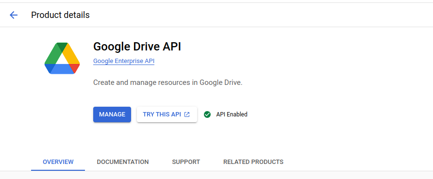
- When you go back to the ```Enabled APIs & Services``` page, you will see that the enabled API has appeared in the list.


Following the same steps above, enable the following APIs : 
 - [Google Drive](https://console.cloud.google.com/apis/library/drive.googleapis.com)
 - [Google Calendar](https://console.cloud.google.com/apis/library/calendar-json.googleapis.com)
 - [Google Slides](https://console.cloud.google.com/apis/library/slides.googleapis.com)
 - [Google Docs](https://console.cloud.google.com/apis/library/docs.googleapis.com)
 - [Google Sheets](https://console.cloud.google.com/apis/library/sheets.googleapis.com)
 - [Gmail](https://console.cloud.google.com/apis/library/gmail.googleapis.com)
 - [Contacts](https://console.cloud.google.com/apis/library/contacts.googleapis.com)
 - [People](https://console.cloud.google.com/apis/library/people.googleapis.com)
-  [Admin SDK](https://console.cloud.google.com/marketplace/product/google/admin.googleapis.com)

## Setting up the OAuth Consent Screen
Once you've enabled the APIs, you'll also need to add the scopes for these APIs. For our app we only require ```readonly``` scopes for all the APIs.
For this navigate to the OAuth Consent Screen in the Sidebar of your Google Cloud Console : 
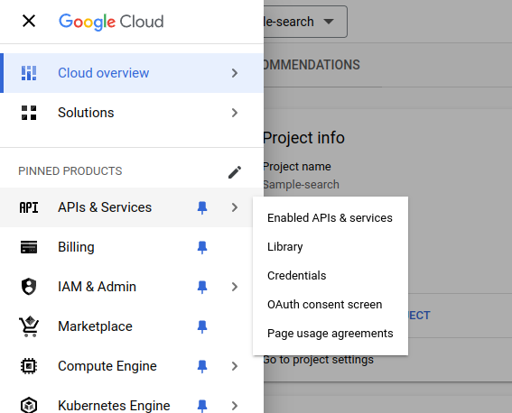

Under ```OAuth Consent``` screen select ```Internal``` : 
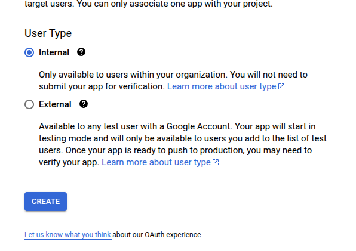

Click on ```Create```

Under the ```App Information``` Section, fill out the details :
 - Provide a Name for the app (For ex: Xyne)
 - Provide a User Support email (For ex: your-email@gmail.com)
 - Upload an App Logo (if needed)
 - Put your domain under ```Authorised``` domain (You can choose to go ahead with your localhost or AWS IP Address)
 - Add Developer contact information (For ex: your-email@gmail.com)

 Click ```Save and Continue```

Under the ```Scopes``` section, you'll see the ```Add or Remove Scopes``` button. Click on that button : 
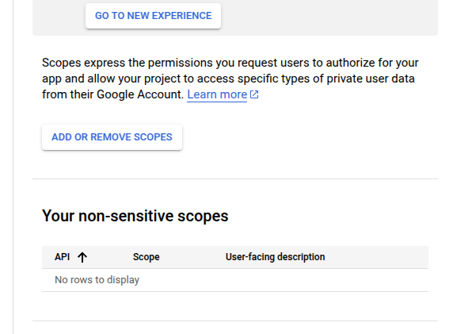

You will see the scopes on the right side like this :
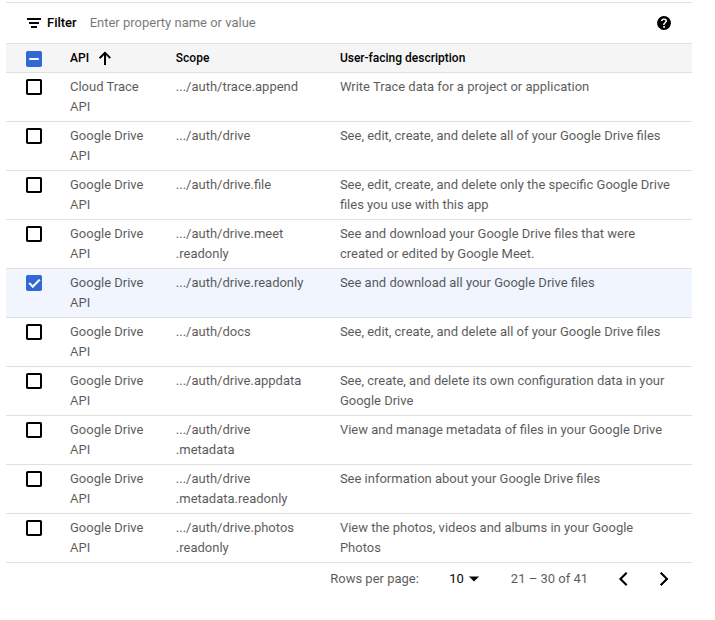

Ensure to select the checkbox for these scopes : 
 - ```.../auth/userinfo.email``` 
 - ```.../auth/userinfo.profile```
 - ```openid```
 - ```../auth/drive.readonly```
 - ```../auth/admin.directory.user.readonly```
 - ```../auth/documents.readonly```
 - ```../auth/spreadsheets.readonly```
 - ```../auth/presentations.readonly```
 - ```../auth/contacts.readonly```
 - ```../auth/contacts.other.readonly```
 - ```../auth/gmail.readonly```
 - ```../auth/calendar.events.readonly```
 - ```../auth/admin.directory.user.readonly```

You can also choose to ```manually``` add the scopes in the ```box``` below.

```javascript
  https://www.googleapis.com/auth/userinfo.email,
  https://www.googleapis.com/auth/userinfo.profile,
  openid,
  https://www.googleapis.com/auth/drive.readonly,
  https://www.googleapis.com/auth/admin.directory.user.readonly
  https://www.googleapis.com/auth/documents.readonly,
  https://www.googleapis.com/auth/spreadsheets.readonly,
  https://www.googleapis.com/auth/presentations.readonly,
  https://www.googleapis.com/auth/contacts.readonly,
  https://www.googleapis.com/auth/contacts.other.readonly,
  https://www.googleapis.com/auth/gmail.readonly,
  https://www.googleapis.com/auth/calendar.events.readonly,
  https://www.googleapis.com/auth/admin.directory.user.readonly,


  
```

Leave the next page ,i.e. ```Test users``` blank.
This concludes the setting-up of your OAuth Consent Screen

### Setting up the Service Account and Credentials
First, from the menubar on the side, navigate to the ```IAM & Admin``` section. In there look for the ````Service Account```` section. Or directly visit [here](https://console.cloud.google.com/iam-admin/serviceaccounts), and then select your project.
In there click on  ```+ CREATE SERVICE ACCOUNT ```.
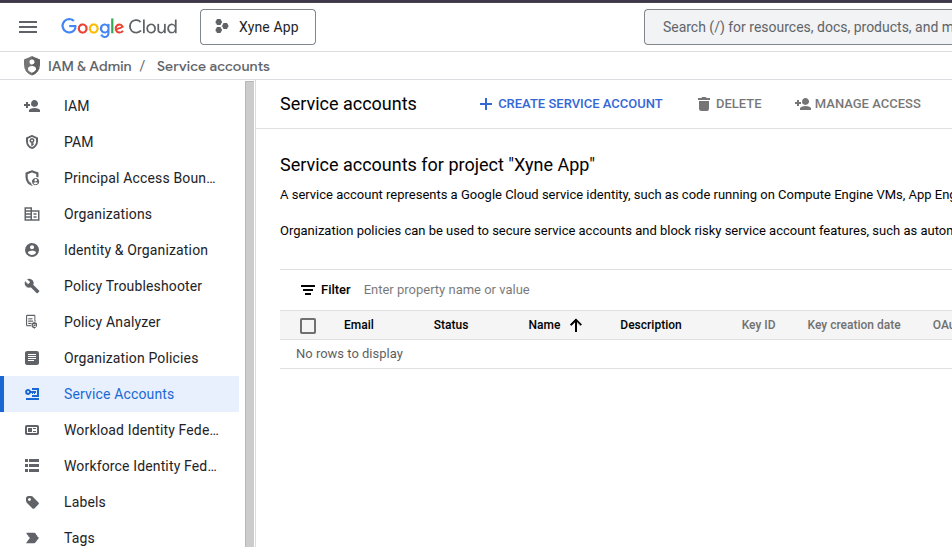

Here, you will see the form that requires you to fill all the details about your service account.
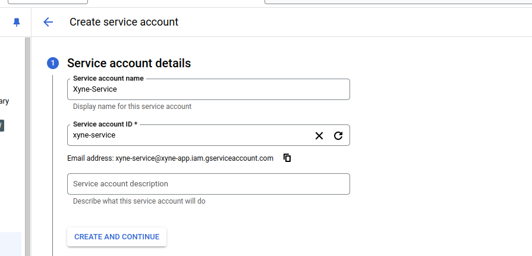

Once you've filled out the details, click on `CREATE AND CONTINUE`

- Grant the roles, based on the internal policies preferred by your organisation, in the account. 
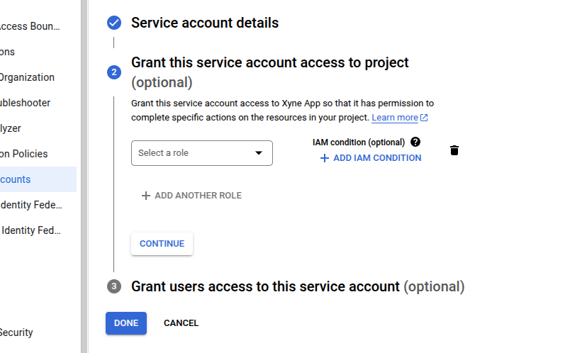
- Click on ```continue```.

- Optionally you can allow a list of users to access the service account:
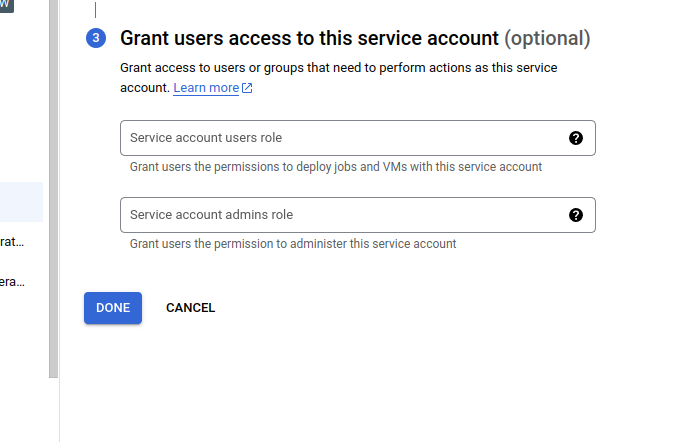

- Click on ```Done```

- Once the service account has been created, you'll be able to see it under the ```Service Accounts``` table in the ```Service Account``` section.

- In the ```Service Account``` table where you can see your newly created service account, you will find an ```Actions``` column. 
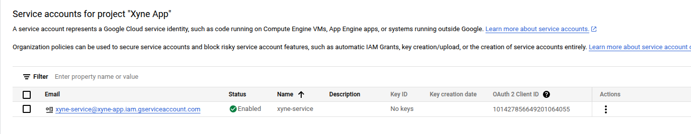
- Click on the three dots in the ```Actions``` column, and click in ```Manage Keys```.
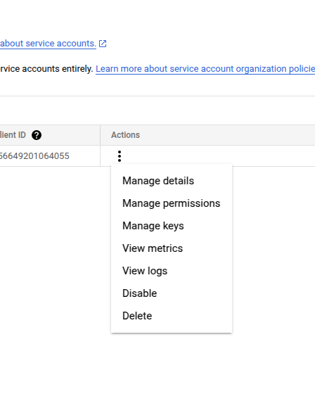
- In there navigate to the ```keys``` tab.
- Click on ```ADD KEY```, followed by clicking on ```Create New Key```
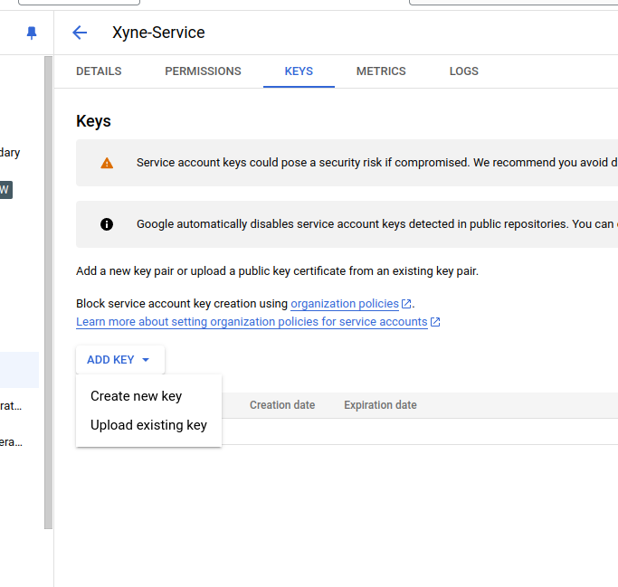
- Choose the ```json``` option for downloading the key file, and click on ```Create```.
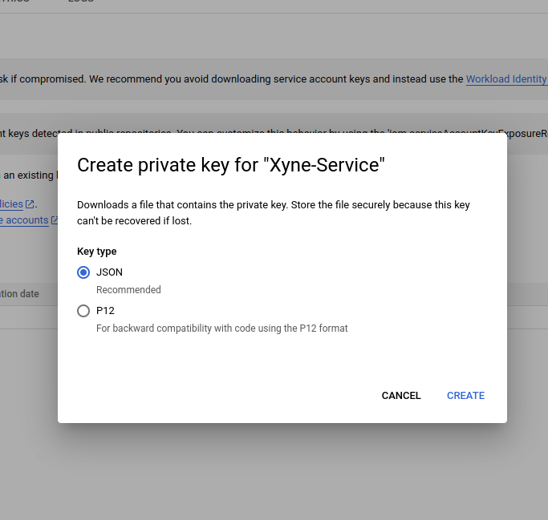
- Remember the ```Client id``` associated with this json file.
- Once the key file has been created, choose a reliable location for downloading the key file, this will be used for putting it in the [```.env``` of the application](https://xyne.mintlify.app/deployment/aws/aws-deployment#setup-environment-variables)


## Setting up Delegation

- Now that all of this is done, the ```Worspace Admin``` needs to do some delegations, navigate to [Domain Wide Delegation](https://admin.google.com/ac/owl/domainwidedelegation). 
- Click on ```Add New``` 
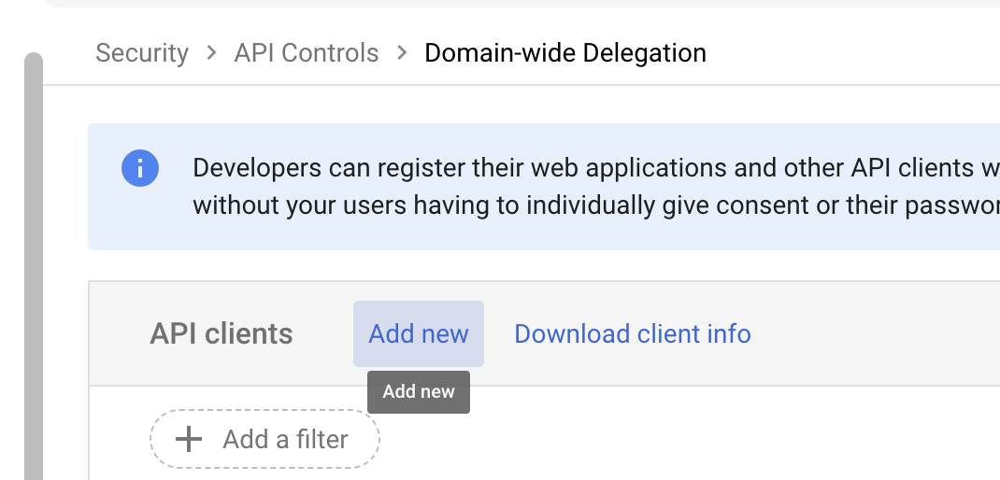
- In there paste the ```OAuth Client Id``` that you received when creating the service account key.
- Paste the following scopes : 
```javascript
https://www.googleapis.com/auth/drive.readonly,https://www.googleapis.com/auth/documents.readonly,https://www.googleapis.com/auth/spreadsheets.readonly,https://www.googleapis.com/auth/presentations.readonly,https://www.googleapis.com/auth/contacts.readonly,https://www.googleapis.com/auth/contacts.other.readonly,https://www.googleapis.com/auth/gmail.readonly,https://www.googleapis.com/auth/calendar.events.readonly,https://www.googleapis.com/auth/admin.directory.user.readonly
```
- Click on ```Authorize```.
