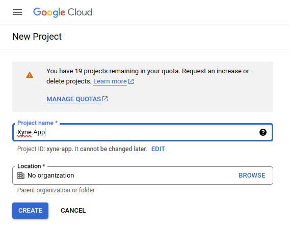
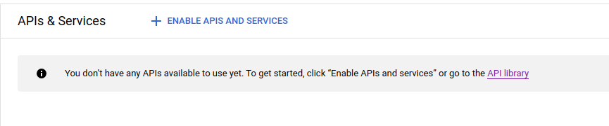
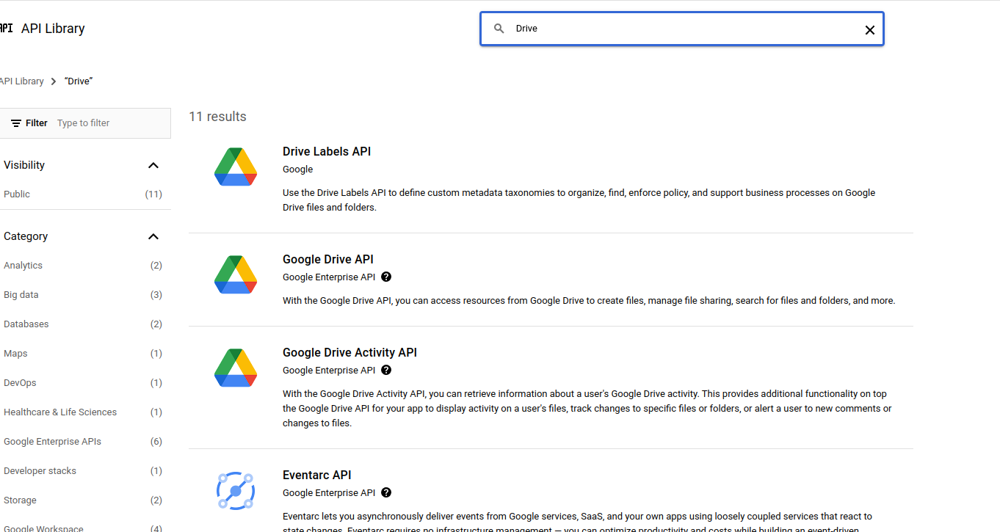

## Setting up a project in Google Cloud Console
Create a new project in [Google Cloud Console](https://console.cloud.google.com/projectcreate) 


### Setting up the Oauth Consent Screen
Navigate to the Oauth Consent Screen in the Sidebar of your Google Cloud Console : 


Under ```OAuth Consent``` screen select either Internal or External, depending on your requirement : 

 -  - Since you're have a Google Workspace, you should choose ```Internal```

Click on ```Create```


Under the ```App Information``` Section, fill out the details :
 - Provide a Name for the app (For ex: Xyne)
 - Provide a User Support email (For ex: your-email@gmail.com)
 - Upload an App Logo (if needed)
 - Put your domain under ```Authorised``` domain (You can choose to go ahead with your localhost or AWS IP Address)
 - Add Developer contact information (For ex: your-email@gmail.com)

 Click ```Save and Continue```

Under the ```Scopes``` section, you can choose to add the basic scopes ,
 - ```.../auth/userinfo.email``` 
 - ```.../auth/userinfo.profile```
 - ```openid```

Leave the next page ,i.e. ```Test users``` blank.
This concludes the setting-up of your Oauth Consent Screen

### Setting up the Service Account Credentials

Furthermore Under APIs and Services section,

- Navigate to the Credentials Section in the sidebar, and click on  ```+CREATE CREDENTIALS ```. 
Under that select the ```Service Account``` option. 


- Under the Service Account Details section, provide an account name. 
- The Service Account ID will be automatically generated with the given name.
- You can choose to give a description of the account if you choose to.
- Click on continue.


- Grant the role of ```owner``` in the account. 
- Click on continue.


- Optionally you can allow a list of users to access the service account:


- Click on ```Done```

- Once the service account has been created, you'll be able to see it under the ```Service Accounts``` table in the ```Credentials``` section.
- Click on the email generated by the service account.
- Navigate to the ```keys``` tab.
- Click on ```ADD KEY```, followed by clicking on ```Create New Key```

- Choose the ```json``` option for downloading the key file, and click on ```Create```.

- Once the key file has been created, choose a reliable location to downloading the key file, this will be used for putting it in the [```.env``` of the application](https://xyne.mintlify.app/deployment/aws/aws-deployment#setup-environment-variables)

## Enabling APIs
The last step is to enable the APIs is needed for the app.
- From the menu in the side bar, under APIs and Services section select the ```Enabled APIs & Services```.

- In the ```Enabled APIs & Services``` page, click on the ```+ Enable APIs & Services```.

- You will now see a search box where you can search for the specific API that you want to enable. (For example :  Google Deive API)

- Once you search for an API, you will find a list of APIs. 

- From the list of APIs, select the API that you want to enable. And then click on ```Enable``` in the API page.

- Once the API is enabled, you will see that the Enable button noe changes to Manage. This means that the API has been enabled.

- When you go back to the ```Enabled APIs & Services``` page, you will see that the enabled API has appeared in the list.


Following the same steps above, enable the following APIs : 
 - [Google Drive](https://console.cloud.google.com/apis/library/drive.googleapis.com)
 - [Google Calendar](https://console.cloud.google.com/apis/library/calendar-json.googleapis.com)
 - [Google Slides](https://console.cloud.google.com/apis/library/slides.googleapis.com)
 - [Google Docs](https://console.cloud.google.com/apis/library/docs.googleapis.com)
 - [Google Sheets](https://console.cloud.google.com/apis/library/sheets.googleapis.com)
 - [Gmail] (https://console.cloud.google.com/apis/library/gmail.googleapis.com)
 - [Contacts](https://console.cloud.google.com/apis/library/contacts.googleapis.com)
 - [People](https://console.cloud.google.com/apis/library/people.googleapis.com)
