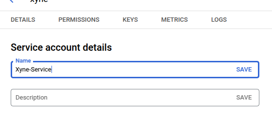
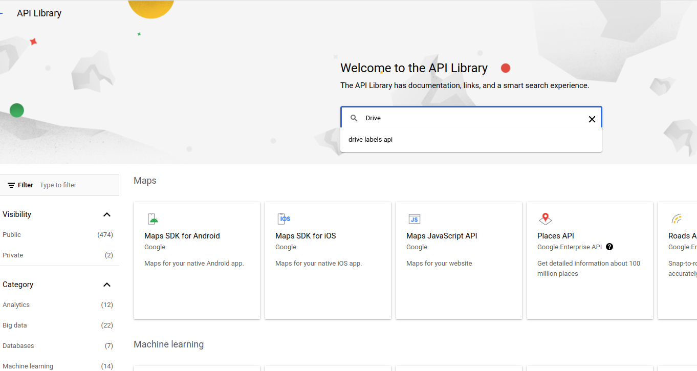

This guide assumes you've already configured your google credentials, incase you haven't follow the guide below to first do that :

<Card
  title="Setup Google Credentials"
  icon="google"
  href="/authentication/get-credentials"
>
Setup your Google Credentials for the application.
</Card>


### Setting up the Service Account and Credentials
First, from the menubar on the side, navigate to the ```IAM & Admin``` section. In there look for the ````Service Account```` section. Or directly visit [here](https://console.cloud.google.com/iam-admin/serviceaccounts), and then select your project.
In there click on  ```+ CREATE SERVICE ACCOUNT ```.


Here, you will see the form that requires you to fill all the details about your service account.


Once you've filled out the details, click on `CREATE AND CONTINUE`

- Grant the roles, based on the internal policies preferred by your organization, in the account. 

- Click on ```continue```.

- Optionally you can allow a list of users to access the service account:


- Click on ```Done```

- Once the service account has been created, you'll be navigated to the service account details page where you can now configure your key..

- In the ```Service Account``` section where you can see your newly created service account, you will find a ```KEYS``` tab.

- In there navigate to the ```keys``` tab.
- Click on ```ADD KEY```, followed by clicking on ```Create New Key```

- Choose the ```json``` option for downloading the key file, and click on ```Create```.

- Remember the ```Client id``` associated with this json file.
- Once the key file has been created, choose a reliable location for downloading the key file, this will be used for putting it in the [```.env``` of the application](https://docs.xynehq.com/quickstart#setting-the-environment-variables)


## Enabling APIs
Switch to the new project you just created.

The first step is to enable the APIs which are needed for the app.
- From the menu in the Sidebar, under APIs and Services section select the ```Enabled APIs & Services```.

- In the ```Enabled APIs & Services``` page, click on the ```+ Enable APIs & Services```.

- You will now see a search box where you can search for the specific API that you want to enable. (For example :  Google Drive API)

- Once you search for an API, you will find a list of APIs. 

- From the list of APIs, select the Google Drive API to enable. And then click on ```Enable``` in the API page.

- Once the API is enabled, you will see that the Enable button now changes to ```Manage```. This means that the API has been enabled.

- When you go back to the ```Enabled APIs & Services``` page, you will see that the enabled API has appeared in the list.


Following the same steps above, enable the following APIs : 
 - [Google Drive](https://console.cloud.google.com/apis/library/drive.googleapis.com)
 - [Google Calendar](https://console.cloud.google.com/apis/library/calendar-json.googleapis.com)
 - [Google Slides](https://console.cloud.google.com/apis/library/slides.googleapis.com)
 - [Google Docs](https://console.cloud.google.com/apis/library/docs.googleapis.com)
 - [Google Sheets](https://console.cloud.google.com/apis/library/sheets.googleapis.com)
 - [Gmail](https://console.cloud.google.com/apis/library/gmail.googleapis.com)
 - [Contacts](https://console.cloud.google.com/apis/library/contacts.googleapis.com)
 - [People](https://console.cloud.google.com/apis/library/people.googleapis.com)
-  [Admin SDK](https://console.cloud.google.com/marketplace/product/google/admin.googleapis.com)

<Warning> Please make sure to **enable all** the APIs listed above to ensure the Xyne app runs smoothly. </Warning>

## Setting up Delegation

- Now that all of this is done, the ```Workspace Admin``` needs to do some delegations, navigate to [Domain Wide Delegation](https://admin.google.com/ac/owl/domainwidedelegation). 
- Click on ```Add New``` 

- In there paste the ```OAuth Client Id``` that you received when creating the service account key.
- Paste the following scopes : 
```javascript
https://www.googleapis.com/auth/drive.readonly,https://www.googleapis.com/auth/documents.readonly,https://www.googleapis.com/auth/spreadsheets.readonly,https://www.googleapis.com/auth/presentations.readonly,https://www.googleapis.com/auth/contacts.readonly,https://www.googleapis.com/auth/contacts.other.readonly,https://www.googleapis.com/auth/gmail.readonly,https://www.googleapis.com/auth/calendar.events.readonly,https://www.googleapis.com/auth/admin.directory.user.readonly
```
- Click on ```Authorize```.


