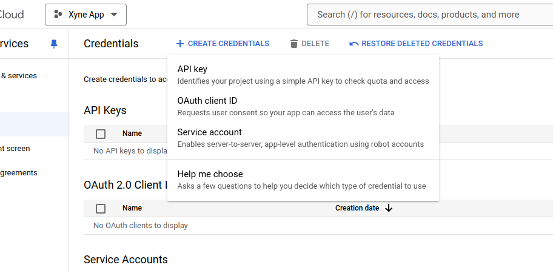

## Setting up a project in Google Cloud Console
Create a new project in [Google Cloud Console](https://console.cloud.google.com/projectcreate) 


### Setting up the Oauth Consent Screen
Navigate to the Oauth Consent Screen in the Sidebar of your Google Cloud Console : 


Under ```OAuth Consent``` screen select either Internal or External, depending on your requirement : 

 - If you're have a Google Workspace, you should choose Internal
 - Otherwise choose External
Click on ```Create```


Under the ```App Information``` Section, fill out the details :
 - Provide a Name for the app (For ex: Xyne)
 - Provide a User Support email (For ex: your-email@gmail.com)
 - Upload an App Logo (if needed)
 - Put your domain under ```Authorised``` domain (You can choose to go ahead with your localhost or AWS IP Address)
 - Add Developer contact information (For ex: your-email@gmail.com)

 Click ```Save and Continue```

Under the ```Scopes``` section, you can choose to add the basic scopes ,
 - ```.../auth/userinfo.email``` 
 - ```.../auth/userinfo.profile```
 - ```openid```

Leave the next page ,i.e. ```Test users``` blank.
This concludes the setting-up of your Oauth Consent Screen

### Setting up the Service Account Credentials

Furthermore Under APIs and Services section,

- Navigate to the Credentials Section in the sidebar, and click on  ```+CREATE CREDENTIALS ```. 
Under that select the ```Service Account``` option. 


- Under the Service Account Details section, provide an account name. 
- The Service Account ID will be automatically generated with the given name.
- You can choose to give a description of the account if you choose to.
- Click on continue.


- Grant the role of ```owner``` in the account. 
- Click on continue.


- Optionally you can allow a list of users to access the service account:


- Click on ```Done```

- Once the service account has been created, you'll be able to see it under the ```Service Accounts``` table in the ```Credentials``` section.
- Click on the email generated by the service account.
- Navigate to the ```keys``` tab.
- Click on ```ADD KEY```, followed by clicking on ```Create New Key```

- Choose the ```json``` option for downloading the key file, and click on ```Create```.

- Once the key file has been created, choose a reliable location to downloading the key file, this will be used for putting it in the [```.env``` of the application](https://xyne.mintlify.app/deployment/aws/aws-deployment#setup-environment-variables)
