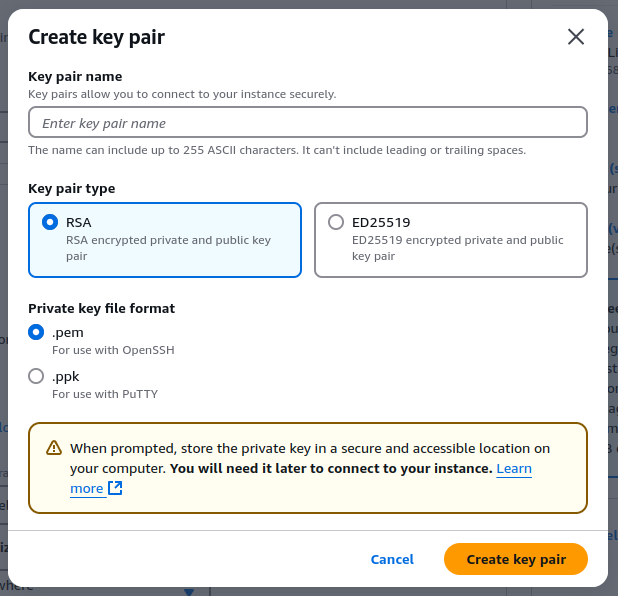

<Tip>We recommend using EC2 Instance for the deployment as it is the simplest to set-up.</Tip>

If you want to deploy Xyne on AWS instead of your local machine, this guide will give you a detailed guide to do so.
Follow the steps listed below to get started : 

<Tip>We recommend using ```RSA``` Key Pair type, with the ```.pem``` file format when creating a key pair.</Tip>




## Connect to the instance remotely: 
Once you have your instance up and running, you can use your terminal to connect to your instance remotely. 
For this you would require your private ssh key which you would have acquired during the creation of your EC2 Instance. 
Use this command to connect to your instance : 

```javascript
ssh -i ~/path/to/your-private-key-file.pem ec2-user@public-ipv4-address [or your-instance-username@public-ipv4-address]
```

## Install the required dependencies : 
Deployment of Xyne on AWS EC2 requires the following dependencies to be installed on the instance:

- [Bun](https://bun.sh/docs/installation)
- [Docker](https://docs.docker.com/engine/install/)
- [Docker Compose](https://docs.docker.com/compose/install/)
- [Vespa CLI](https://docs.vespa.ai/en/build-install-vespa.html)

Once you have installed the dependencies, you can use the following steps to set up the instance.

<Warning>Ensure you have an instance with enough storage to store the dependencies and run the Xyne Application</Warning>


## Use Docker To Load the Image : 

Use the following docker command to load the image of Xyne.
```javascript
docker load < image-name.tar.gz
```

## Extract the project

To extract the project, you first need to run the container with the loaded image, and then extract the project : 

- Run the docker container with the image :
```javascript
docker run --name your-container-name -p 80:80 image-name
```
- Make a directory called ```xyne``` from your root instance, use the following command :
```javascript
sudo mkdir xyne
```

- Extract the project inside the ```xyne``` folder, use the following command : 
```javascript
docker cp <container:id>:usr/src/app /home/your-instance-username/xyne/search
```
#### You can now remove the container : 

 - Stop the conatiner if not already stopped :
    ```javascript
    docker stop <container_name_or_id>
    ```
 - Remove the container :
    ```javascript
    docker rm <container_name_or_id>
    ```

### Setup Environment variables: 
Inside the ```server``` folder of the ```xyne/search``` folder, create a ```.env``` file using :
```javascript
sudo touch .env
```
In the ```.env``` file, you can paste the following :

```javascript .env file
NOTION_API_KEY=<YOUR_NOTION_SECRET>
ENCRYPTION_KEY=<YOUR_ENCRYPTION_KEY>
# If you wish to execute authorization using Service Account then use :
 SERVICE_ACCOUNT_ENCRYPTION_KEY=<YOUR_SERVICE_ACCOUNT_ENCRYPTION_KEY> 
# If you wish to execute authorization using Oauth then use :   
GOOGLE_CLIENT_ID=<YOUR_GOOGLE_CLIENT_ID>
GOOGLE_CLIENT_SECRET=<YOUR_GOOGLE_CLIENT_SECRET>
GOOGLE_REDIRECT_URI=http://localhost:3000/v1/auth/callback
GOOGLE_PROD_REDIRECT_URI=<YOUR_Public_IPv4_DNS_ADDRESS>/v1/auth/callback
POST_OAUTH_REDIRECT=http://localhost:5173/
POST_OAUTH_PROD_REDIRECT=<YOUR_Public_IPv4_DNS_ADDRESS>
JWT_SECRET=<YOUR_JWT_SECRET>
DATABASE_HOST=0.0.0.0
VESPA_HOST=0.0.0.0
AWS_ACCESS_KEY=<YOUR_AWS_ACCESS_KEY>
AWS_SECRET_KEY=<YOUR_AWS_ACCESS_SECRET>
OPENAI_API_KEY=<YOUR_OPEN_API_KEY>

```

### Set permissions for vespa to run : 

From the root of the instance, use the following commands : 
```javascript
# Create directories
sudo mkdir -p xyne/search/server/vespa-data
sudo mkdir -p xyne/search/server/vespa-logs

# Set correct ownership
sudo chown -R 1000:1000 xyne/search/server/vespa-data
sudo chown -R 1000:1000 xyne/search/server/vespa-logs

# Set correct permissions
sudo chmod -R 755 xyne/search/server/vespa-data
sudo chmod -R 755 xyne/search/server/vespa-logs
```

## Deploy Vespa and Postgres with Docker  :

Navigate to the ```deployment``` folder : 
```javascript 
cd xyne/search/deployment
```
Once inside the ```deployment``` folder, run the following command to run vespa and postgres in docker :
```javascript 
docker-compose -f deployment/docker-compose.prod.yml up
```

### Deploy Vespa in your instance : 

Navigate to ```server/vespa``` folder and set-up vespa : 

<Warning> Ensure ```Vespa CLI``` is installed in the instance for it to work.</Warning>


```javascript
./deploy.sh
```

### Migrate PostgreSQL Schema

Navigate to the server folder using ```cd server``` and run the following commands : 

```javascript
bun install
```
This will install all the dependencies required by the server to run the application successfully.

```javascript
bun run generate
```
```javascript
bun run migrate
```
This will generate and migrate the postgres schema.

### Build the Xyne client
To start the client side, navigate to the frontend folder using ```cd frontend``` and run the following command : 

```javascript
bun install
```
This installs all dependencies required by the client side to run.

Then start the client using the command : 

```javascript
bun run build
```
This will build the client side of the application.

### Start the Xyne server

Once vespa has been deployed and the docker is running both Vespa and PostgreSQL containers, it is time to start the Xyne server.
To do that, navigate back to the ```server``` folder. Once inside the server folder, run the following command : 

```javascript
sudo NODE_ENV=production $(which bun) run server.ts
```

Your application is now running and will be available in your EC2 Public IPv4 DNS address.


