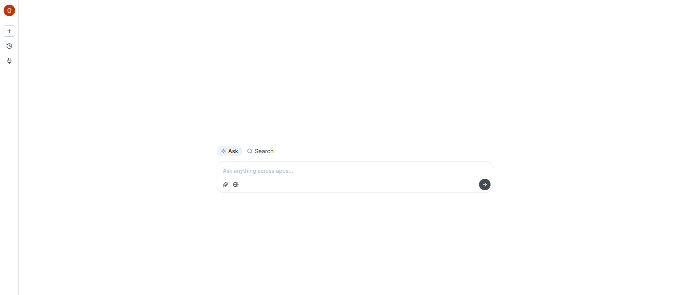
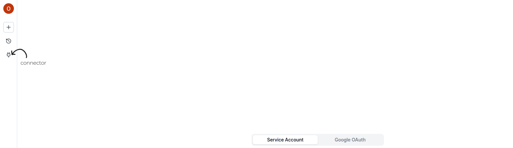

This guide assumes you have created the required authentication keys, and will show you how to ingest your data into the Xyne application. 

<Tip>If you're running the application individually and just trying it out, we recommend using OAuth authentication. 
Service accounts are better suited for organizations.</Tip>

<Note> You only need one type of Authentication, either OAuth Authentication [best suited for individual users] or Service Account Authentication  [best suited for organizations]. </Note>

If you haven't already setup the authentication, follow this guide below :

<CardGroup>

<Card
  title="Oauth Authentication"
  icon="lock"
  href="/authentication/oauth"
>
Authenticate with Oauth Account.
</Card>

<Card
  title="Service Account Authentication"
  icon="gear-code"
  href="/authentication/service-accounts"
>
Authenticate with Service Account.
</Card>

</CardGroup>

## Connect to Google Integration and ingest data: 

Once you have setup the authentication keys and have started the application, you will see your application running in the browser. 

 - Once you login with your google account successfully, this screen will appear :



 - On the left you will find a ```plug``` icon. That's our connector.  


- Now depending on which authentication key you have configured, you can choose ingestion using ```Oauth Account``` or ingest using ```Service Account```.


<CardGroup>

<Card
  title="Ingestion using Oauth Account"
  icon="key-skeleton"
  href="/ingestion/oauth-ingest"
>
Ingestion with Oauth Account.
</Card>

<Card
  title="Ingestion using Service Account"
  icon="shield-keyhole"
  href="/ingestion/service-ingest"
>
Ingestion with Service Account.
</Card>

</CardGroup>