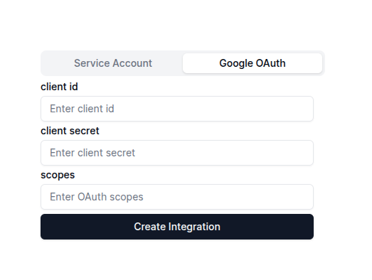

This guide shows you how to ingest data using the oauth account key :

When you switch to the Google OAuth account tab in the connectors page, you'll come across this form :



Here, you need  to enter the ```Google Client Id```, ```Google Client Secret``` that you had created when creating the oauth account key as well as the ```list of scopes``` that you had enabled.

```javascript
https://www.googleapis.com/auth/drive.readonly,https://www.googleapis.com/auth/documents.readonly,https://www.googleapis.com/auth/spreadsheets.readonly,https://www.googleapis.com/auth/presentations.readonly,https://www.googleapis.com/auth/contacts.readonly,https://www.googleapis.com/auth/contacts.other.readonly,https://www.googleapis.com/auth/gmail.readonly,https://www.googleapis.com/auth/calendar.events.readonly
```

Once you have uploaded the file, click on ```Create Integration```. This will create the Google integration, Once that done, you will see the ```Connect with Google OAuth``` button. 
Click on that button, you will see the screen where you can choose which account you want to connect with. Select the account you want to connect with and this should start your integration.You'd be able to see ```Connecting``` under the Google Oauth tab, and the realtime data of your synced files will appear.

Once the ingestion has completed, you can go back to the Xyne App's Chat Or Search section using the ```+``` icon on the left side menu to start a new chat.