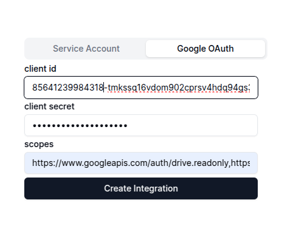

This guide shows you how to ingest data using the oauth account key :

When you switch to the service account tab in the connectors page, you'll come across this form :



Here, you need  to enter the Google Client Id, Google Client Secret that you had created when creating the oauth account key as well as the ```list of scopes``` that you had enabled.

Once you have uploaded the file, click on ```Create Integration```. This will create the Google integration, Once that done, you will see the ```Connect with Google OAuth``` button. 
Click on that button to start the ingestion of your google data. 

Once the ingestion has completed, you can go back to the Xyne App's Chat Or Search section using the ```+``` icon on the left side menu to start a new chat.