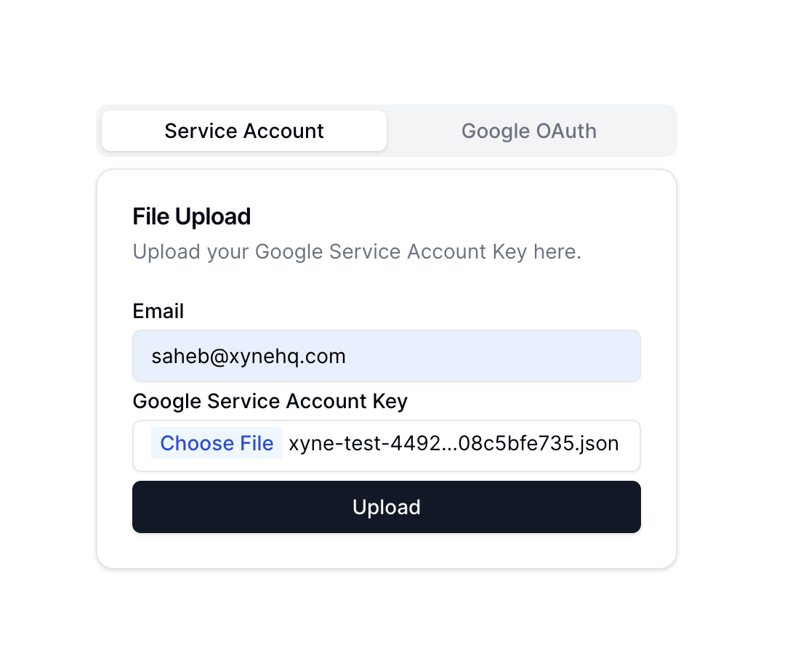
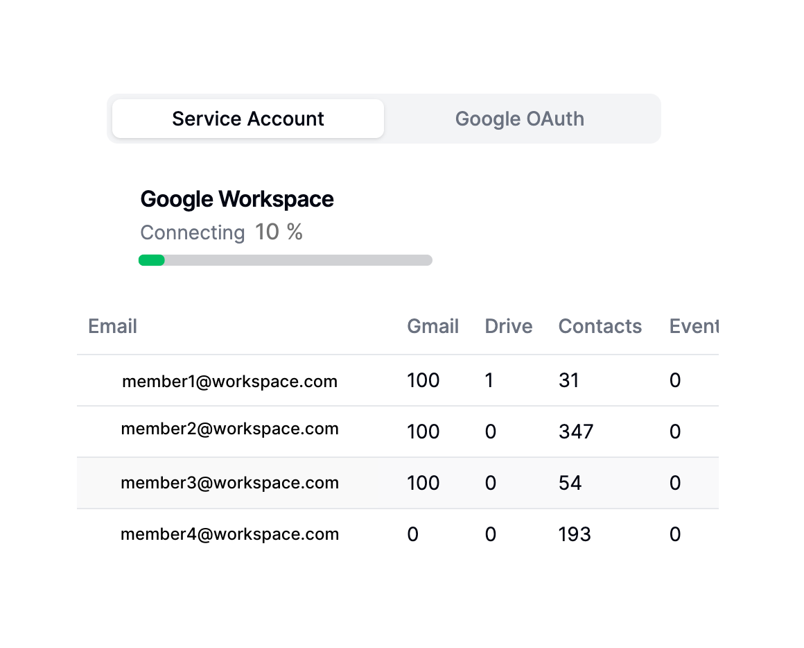

This guide shows you how to ingest data using the service account key :

When you switch to the service account tab in the connectors page, you'll come across this form :



Here, you need  to enter the service account email along with the service account key, i.e., the ```service-account.json``` file that you had created when creating the service account key.

Once you have uploaded the file, click on ```Upload```. This will start the ingestion with the service account : 



Once the ingestion has completed, you can go back to the Xyne App's Chat Or Search section using the ```+``` icon on the left side menu.