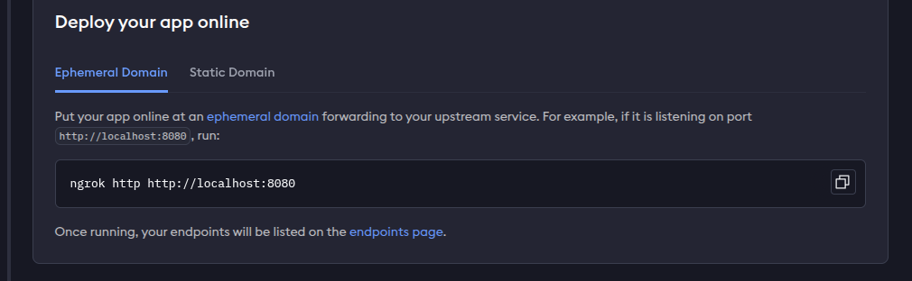
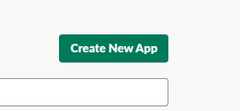
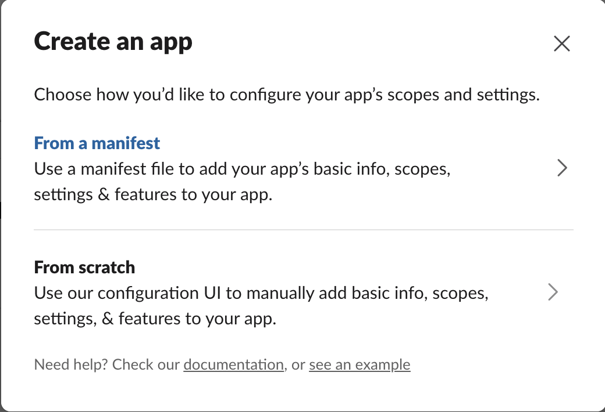
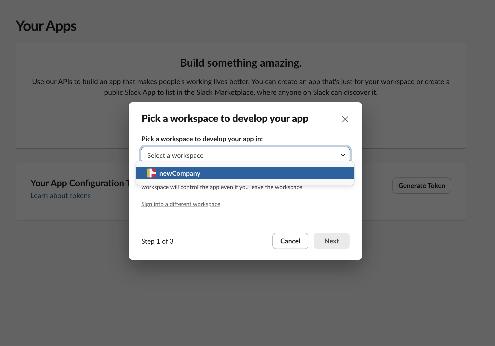
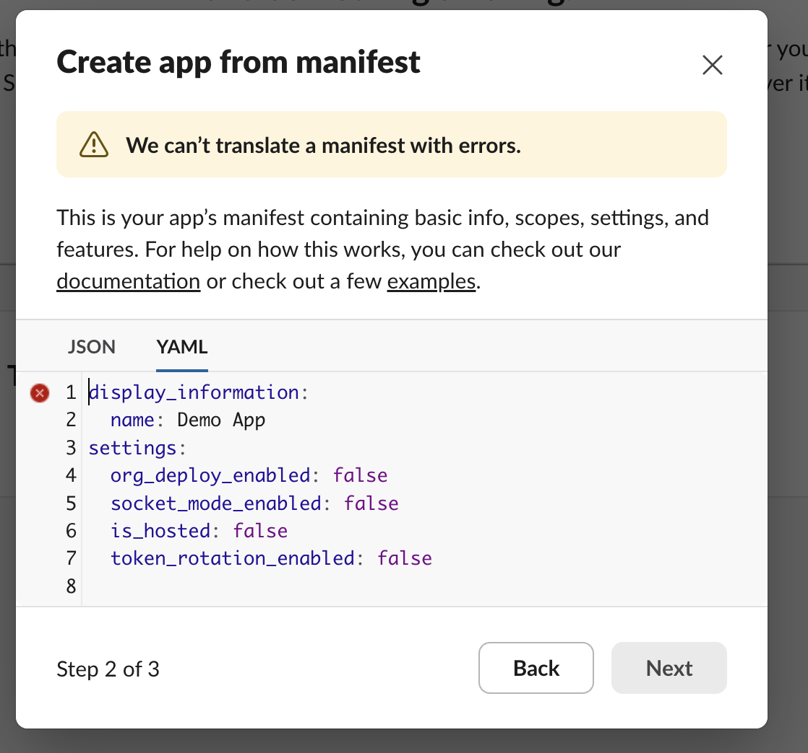
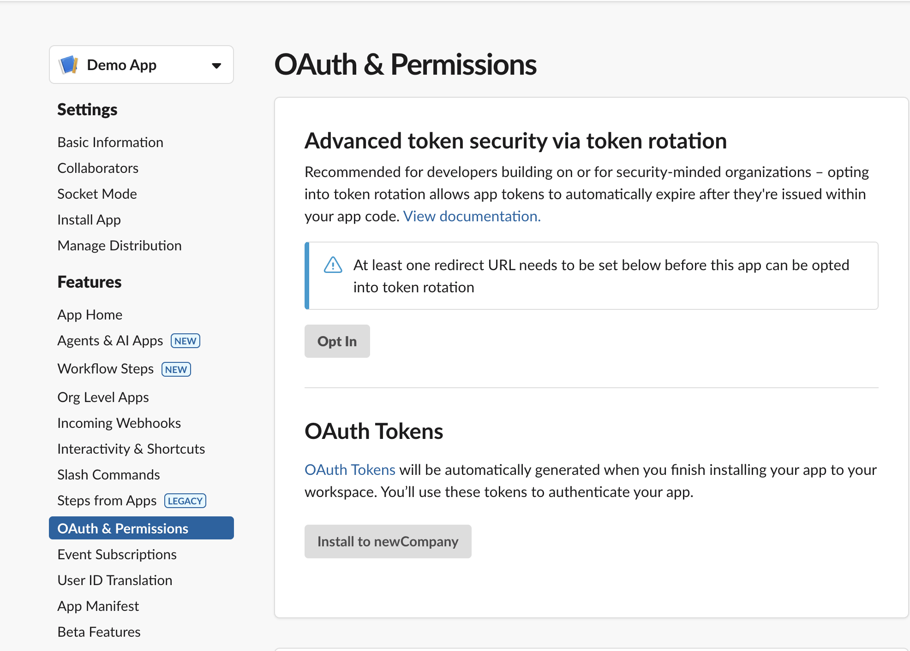
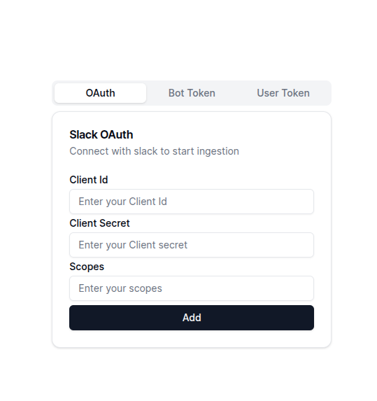

## Creating an App in Slack : 
### Step 1 - Port Forwarding 

#### Using Ngrok

Follow these steps for Ngrok port forwarding : 

- Signup to [Ngrok dashboard](https://dashboard.ngrok.com/login)
- Once you've signed up , based on which OS your system is running on, you'll automatically be redirected to the installation steps for that particular OS.

 

- In the last step, replace the port number from 8080 to `http://localhost:3000`

 

 - Once the port has been forwarded successfully you'll get some URL like this 

 ```javascript
   `https://80bb-14-158-92-844.ngrok-free.app -> http://localhost:3000`
 ```


To be able to ingest Data into Slack, you will first need to create a Slack App.

### Step 2 - Creation of the App :
 To create the slack application : 
 
 - Visit [Slack's API site](https://api.slack.com/apps).
 - Once on the page, you will see the `Create New App` button, on the top right corner of the page.

 

 - Click on the `Create New App` button, and you'll see the following screen :

 
 
 - In here, select `From a manifest`. Once you click on that you'll be asked to select a workspace. In there, select `your organization` name. 

 <Note> Since you'll most likely be logged into slack with your organization's credentials, the name of your organization should automatically appear in the dropdown menu</Note>

 

 - Once you've selected your organization, you'll see a modal, where you're asked to paste the manifest in json or yaml form.
 

 - In the `YAML` tab, paste the following :

 ```yaml
 display_information:
  name: Xyne Test App # Replace with the name you want to give.
oauth_config:
  redirect_urls:
    - https://<YOUR_REDIRECT_URL_VALUE>/oauth/callback # The port forwarded URL you received from cloudflare or ngrok
  scopes:
    user:
      - channels:history
      - channels:read
      - groups:history
      - groups:read
      - im:history
      - im:read
      - mpim:history
      - mpim:read
      - team:read
      - usergroups:read
      - users:read
      - users:read.email
settings:
  org_deploy_enabled: false
  socket_mode_enabled: false
  token_rotation_enabled: false
```

- Once you've pasted the YAML content, click on `next`, this will take you to the `Review` screen. Here you can review the details of your application.

- Once you are sure of the details, click on `Create`. 

- This will take you to the created App screen, where you'll be able to find basic information about your application.

### Step 3 - Installing the App

The next step to this is to `install` the app on your organization. For this : 
- In the App details page, navigate to the `OAuth & Permissions` section, inder `Features`.

 

- In the `OAuth and Permissions` area, you'll find an `Install to your_organization_name`. Once installation is complete you'll see an `OAuth Token`.


### Step 4 - Changes in .env of the project :

#### Frontend : 
- In the `.env` of the frontend of Xyne, add the following : 
```javascript
VITE_API_BASE_URL=https://<YOUR_GENERATED_REDIRECT_URL>
VITE_WS_BASE_URL=ws://<YOUR_GENERATED_REDIRECT_URL>
```
- Once added run `bun run build` in the frontend folder.

#### Backend :

```javascript
SLACK_HOST=<YOUR_GENERATED_REDIRECT_URL>
```

- Now start the app again, and this time, visit the Ngrok generated url. 

- Once in the page, navigate to the connectors section.

- In there click on `Slack`. You'll see a form for ingesting your data.

 

- In that form, fill out the `Client ID`, `Client Secret`, and `Scopes` for the slack data. You can find the client id and secret in the `Basic information` section for the slack app you created.

- Here's the scopes you need to use : 
```javascript
channels:history,groups:history,im:history,mpim:history,channels:read,groups:read,im:read,mpim:read,team:read,users:read,users:read.email,usergroups:read
```

- After adding the scope, just click on the `Add` button. This should start your slack data ingestion.