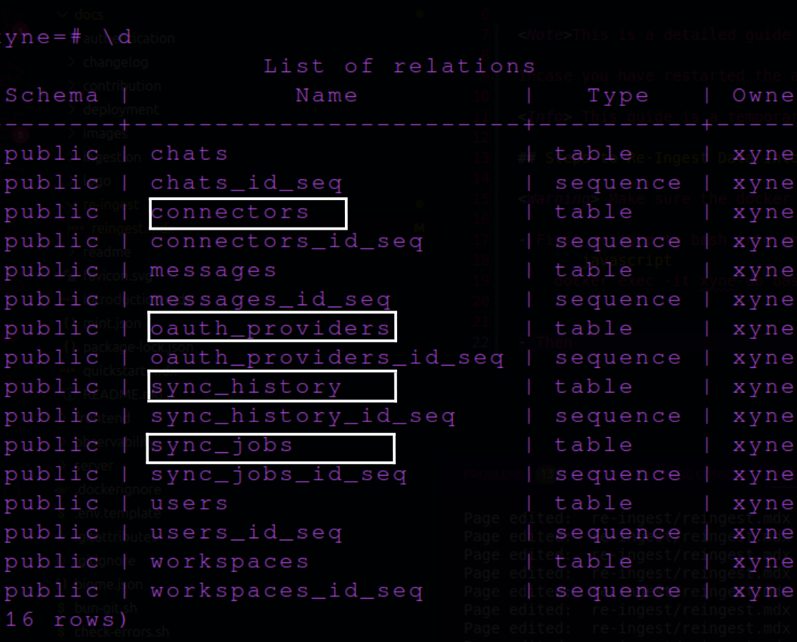

<Note>This is a detailed guide to help you re-ingest your data into the Xyne app, whether it's using the OAuth account or Service Account.</Note>

Incase you have restarted the app or simply want to re-ingest your data into the Xyne app, you can use the following steps to do so : 

<Info> This guide is a temporary solution to help you re-ingest your data into the Xyne app, we will soon be creating a UI for it for easier use </Info>

## Steps to Re-Ingest Data into the Xyne app:

<Warning> Make sure the docker containers are ***running***, this is required for the following changes you'll make.</Warning>

- First we need to bash into the docker container running the database, i.e., ```xyne-db```. For this use :
    ```javascript
    docker exec -it xyne-db bash
    ```

- Then, once you're inside the docker container, you'll see the following :
    

- This means you're now inside the docker container successfully, after this you need to login to the postgres database as a xyne user. 

-  For this, use the following command :
    ```javascript
    psql -U xyne
    ```

- Once you've logged in to the postgres database as a Xyne user, you will see this :
    

- Next, you wanna see the list of tables in the database, use : 
    ```javascript
    \d
    ```
- This will show you the list of tables in the postgres database, out of the tables, we will be working with ```connectors``` and ```oauth_providers``` and also ```sync_jobs```.
    

- Now we will have a look at the contents of each table using the following commands :
    <Tip>You can use ```q``` to exit viewing the table contents</Tip>

    - Oauth Providers
    ```javascript
    select * from oauth_providers;
    ```
     - Connectors
    ```javascript
    select * from connectors;
    ```
    and 

    - Sync Jobs
    ```javascript
    select * from sync_jobs;
    ```

<Tip>If you don't see an output for any of the above tables, you can refrain from following the next step for that specific table only.</Tip>

- This will show you the contents of the table. 

- Now lets remove the contents of the tables, for this use  :

    - Oauth Providers
    ```javascript
    truncate table oauth_providers;
    ```
     - Connectors
    ```javascript
    truncate table connectors;
    ```
    and 

        - Sync Jobs
        ```javascript
        truncate table sync_jobs;
        ```

- Once this is done, you can ```exit``` out of the db and docker-container using the  command: 

    ```javascript
    exit
    ```

- After doing this, when you revisit your connectors page for ingestion, you will see the form for the account like you initially did when ingesting. 