# juspay.pdf

_Exported: 2025-09-17 22:38:36_

## Page 1

<!-- image -->

## Your Payments Innovation Team

One stop solution for everything payments. Experience. Orchestration. Infrastructure.

<!-- image -->

<!-- image -->

### Figures

**Figure 1**

**Figure 2**

**Figure 3**

**Figure 4**

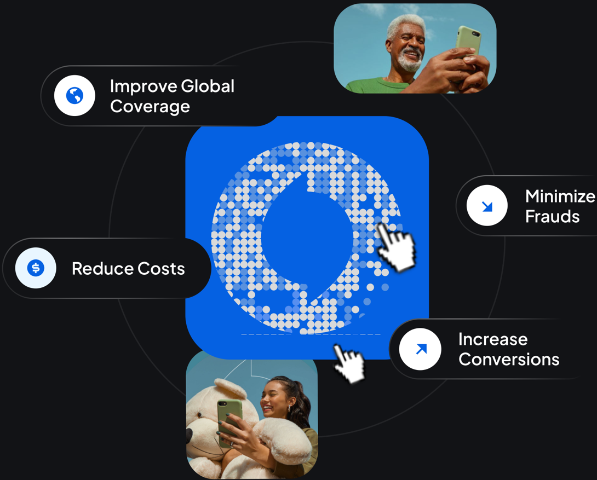

## Page 2

## Page 3

## Delivering for 12+ Years

Experience. Orchestration. Infrastructure.

<!-- image -->

<!-- image -->

### Figures

**Figure 1**

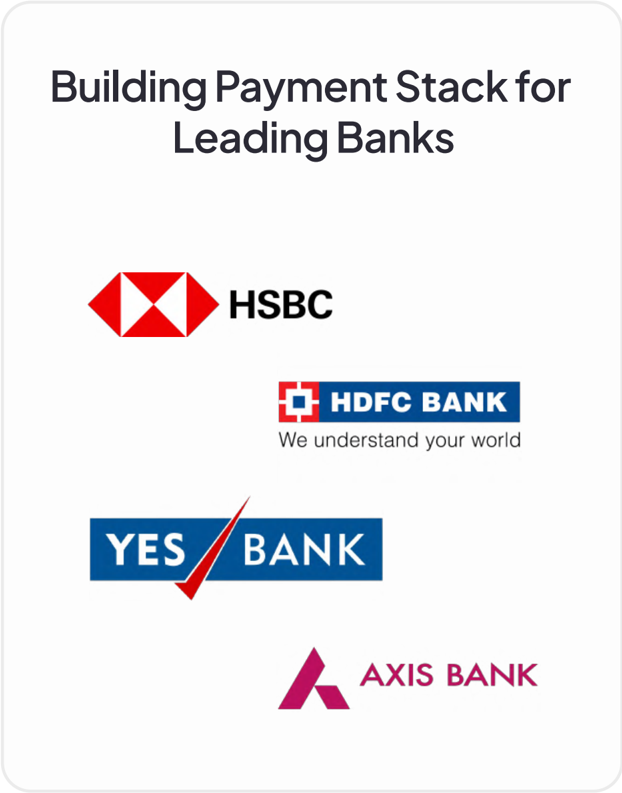

**Figure 2**

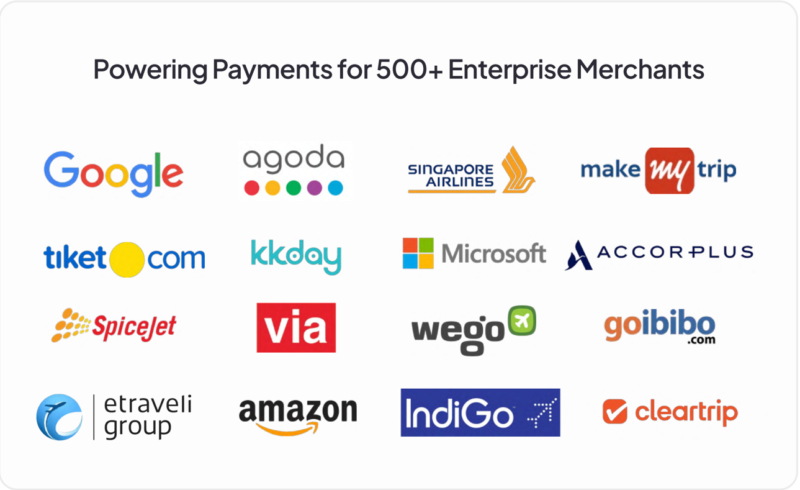

**Figure 3**

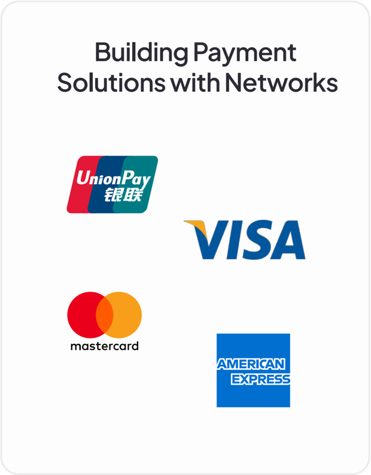

## Page 4

## for over 12+ years! Engineering Payments Global Scale

## Scale

## 8900 Bn +

Annualized TPV

Unifying complex, diverse & innovative payment ecosystem.

<!-- image -->

## Reliability

## 200 Mn +

Txns/day peaking at 20000 tps+

Providing Enterprise-grade products, solutions & support.

Dublin

<!-- image -->

## Network

2.5 Bn +

SDK installs with 400Mn+ mobile users

## I nnovation

1200+ Team

10X Innovations driven by Payments experts

Making Payments Delightful & Seamless for end-users.

<!-- image -->

Extension of your Payment Teams working across countries

Sao P aulo

### Figures

**Figure 1**

**Figure 2**

**Figure 3**

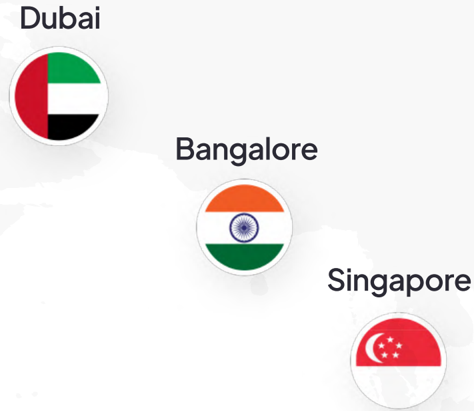

**Figure 4**

## Page 5

## Page 6

## Travel is booming, but the ecosystem continues to be complex & challenging for service providers

<!-- image -->

## Managing complex finOps in their organisation

Virtual cards, payments, reconciliation, supplier,reports, enhanced data, expense management

<!-- image -->

## Expanding globally & staying compliant

Working with local payment methods, multiple currencies, integrations, regulations

<!-- image -->

<!-- image -->

## Managing complex payments process and integrations

Our checkout SDK makes offering any payment methods, offer, EMI option in one click

<!-- image -->

## Friction in payment experience for end users

### Figures

**Figure 1**

**Figure 2**

**Figure 3**

**Figure 4**

**Figure 5**

## Page 7

## A capability-driven payments partner can put the pieces together

<!-- image -->

Make offering any payment methods, offer, EMI options, as simple as switching it onoff.

<!-- image -->

Empower with global coverage

A single switch that gives 90% reduction in dev efforts to integrate with any of the global payment method

Deliver a superior payment experience

A full suite finOps tool for seamless finance mgmt

Maker-checker flows, one click OCR upload, integrations with multiple channels, expense management, workflows

<!-- image -->

High flexibility, low costs, fraud & risk mitigation

### Figures

**Figure 1**

**Figure 2**

**Figure 3**

## Page 8

<!-- image -->

ON A MISSION TO MAKE PAYMENTS A GLOBAL UTILITY

Juspay has built the crucial building blocks in its payment stack to do just that for our travel partners globally

<!-- image -->

### Figures

**Figure 1**

**Figure 2**

**Figure 3**

## Page 9

## Building blocks poised to bring 10X impact for our travel partners, across the ecosystem 🌎

### Figures

**Figure 1**

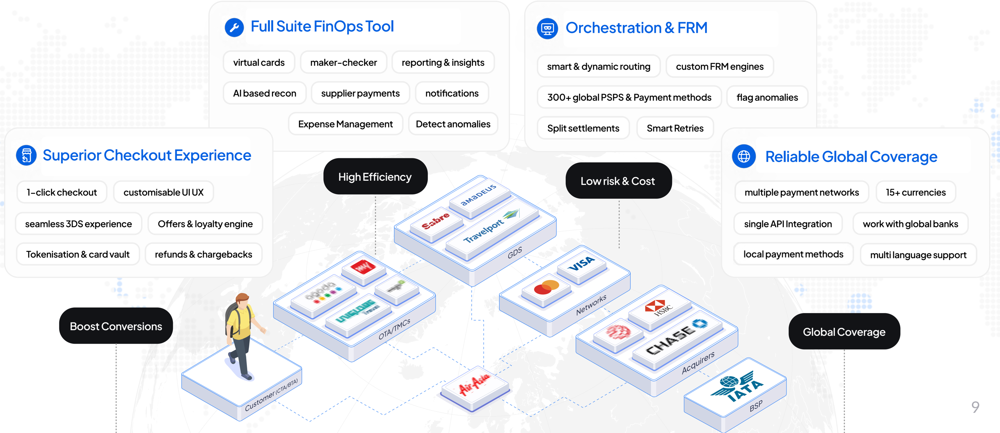

## Page 10

<!-- image -->

<!-- image -->

<!-- image -->

## Your Payments Innovation Team

One stop solution for everything payments - Experience. Orchestration. Infrastructure.

### Figures

**Figure 1**

**Figure 2**

**Figure 3**

**Figure 4**

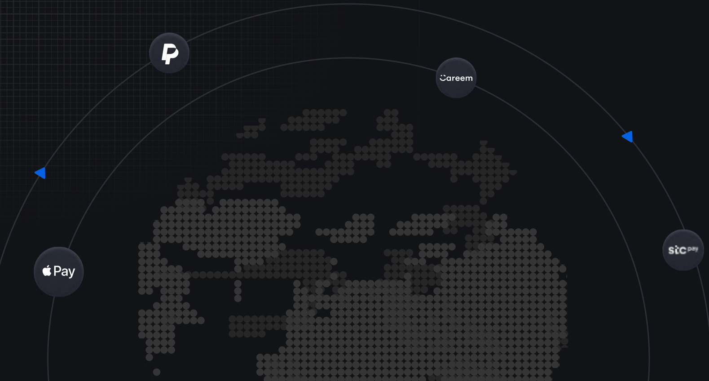

## Page 11

## Our foundational payment blocks

<!-- image -->

### Figures

**Figure 1**

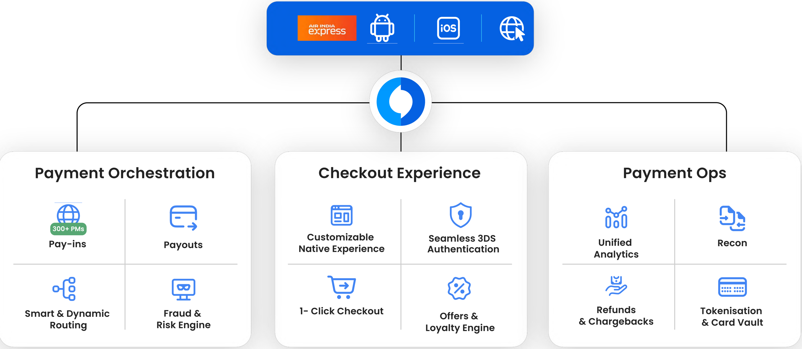

**Figure 2**

## Page 12

## Innovated to Deliver

<!-- image -->

## Increase coverage and Reduce costs

Our unified API integrates with 300+ PMs to achieve 10-30% reduction in payment charges including FX with near zero dev effort.

<!-- image -->

## Build custom solutions

The power of 1200+ payments team to build custom solutions that suits your business needs the best.

<!-- image -->

## Boost conversions & Reduce fraud

Adaptive payment flows to increase auth rate by 710% and reduce chargebacks.

<!-- image -->

## Expand payment flows

### Figures

**Figure 1**

**Figure 2**

**Figure 3**

**Figure 4**

## Page 13

INCREASE COVERAGE AND REDUCE COSTS

## Enable any PSP/ Acquirer/ PM with few clicks on Dashboard

## Work with multiple local acquirers 1

<!-- image -->

· Take advantage of the best competitive fees available in each market

· Work with local PSPs & PMs instead of using global PSP even for cross border transactions

## 2 Direct processing with Acquirers

· Get significant cost savings by working with bank acquirers (ON-US Routing)

· Cost based routing to route a card BIN to specific acquirer

3 Introduce Local Payment Methods

· Provide customers with their choice of payment methods

· Local Payment Methods are often cost effective while giving higher success rates

<!-- image -->

Global PSPs and Payment methods

300+

<!-- image -->

### Figures

**Figure 1**

**Figure 2**

**Figure 3**

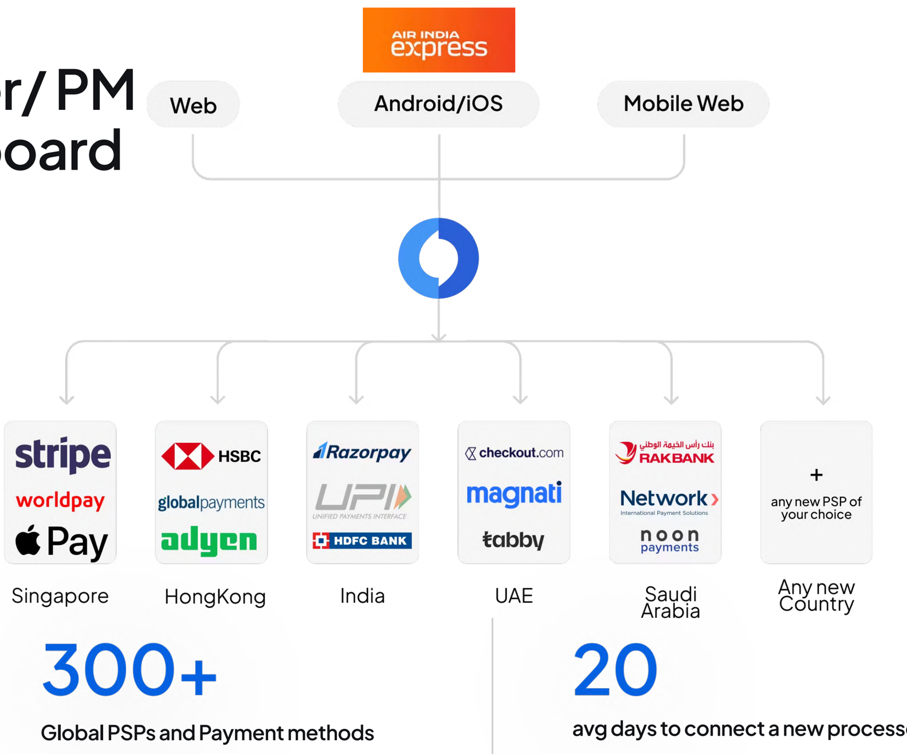

**Figure 4**

## Page 14

## Cross Border Processing vs Local Acquiring - Example

## Page 15

INCREASE COVERAGE AND OPTIMIZE COSTS

## Optimize routing logic per your business rules

Our Router checks for PG health dynamically over a sliding window and does Silent Retries, while giving you complete control and transparency over different routing algos:

<!-- image -->

<!-- image -->

<!-- image -->

<!-- image -->

<!-- image -->

Risk based routing

Conversion based routing

Rule based routing

Cost based routing

Default fallback routing

### Figures

**Figure 1**

**Figure 2**

**Figure 3**

**Figure 4**

**Figure 5**

**Figure 6**

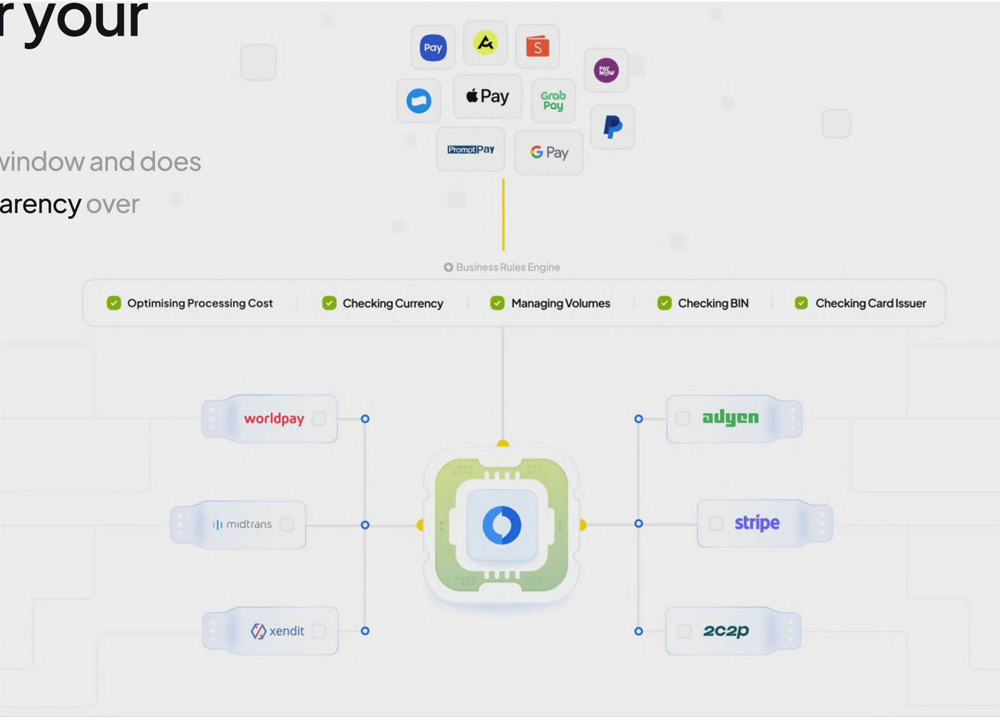

## Page 16

## BOOST CONVERSIONS & REDUCE FRAUD

## Adaptive payment flows based on your data & fallback 3DS

### Figures

**Figure 1**

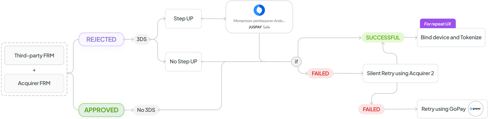

## Page 17

BOOST CONVERSIONS & REDUCE FRAUD

## Salvage failed transactions with Payment Retries new user

<!-- image -->

<!-- image -->

## Silent Retries

· If a transaction fails because of a technical reason, we retry the transaction with a different PSP.

· Te decision whether to retry or not is based on error reason.

## Manual Retries

· In case a transaction fails with a definitive error message, we redirect the user to a Payment Retry screen and nudge the user to use a different Payment Instrument

| Merchant ID   | Success GMV   | Total Success Transactions   | Total Retried GMV   | Total Retried Transactions   | Success Rate   |
|---------------|---------------|------------------------------|---------------------|------------------------------|----------------|
| b 9           | 352,793       | 798                          | 539,021             | 1,163                        | 68.62%         |
|               | 229,852       | 513                          | 344,956             | 745                          | 68.86%         |
|               | 149,088       | 336                          | 310,843             | 626                          | 53.67%         |
|               | 190,204       | 271                          | 916,316             | 1,179                        | 22.99%         |
|               | 203,285       | 264                          | 260,963             | 338                          | 78.11%         |
|               | 218,477       | 224                          | 398,677             | 469                          | 47.76%         |
|               | 414,896       |                              | 1,700,841           | 763                          | 23.85%         |
|               | 563,032       |                              | 821,652             | 251                          | 70.52%         |
|               | 838,128       | 175                          | 1,123,564           | 247                          | 70.85%         |
|               | 124,010       | 153                          | 853,399             | 653                          | 23.43%         |
|               | 424,841       | 147                          | 899,385             |                              | 40.72%         |
|               | 347,240       | 137                          | 1,252,796           |                              | 11.99%         |
| D             | 25,130        | 126                          | 47,321              |                              | 51.22%         |
|               | 1,387,151     | 116                          | 3,379,458           | 233                          | 49.79%         |
|               | 6,423,357     | 111                          | 15,583,594          | 269                          | 41.26%         |

### Figures

**Figure 1**

**Figure 2**

## Page 18

BOOST CONVERSIONS & REDUCE FRAUD

## Adaptive payment flows based on your data & fallback 3DS new user

Select the most optimized flow to balance user experience and fraud prevention, leveraging customer and payment data.

<!-- image -->

### Figures

**Figure 1**

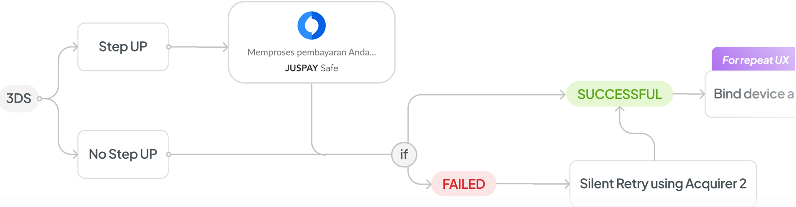

**Figure 2**

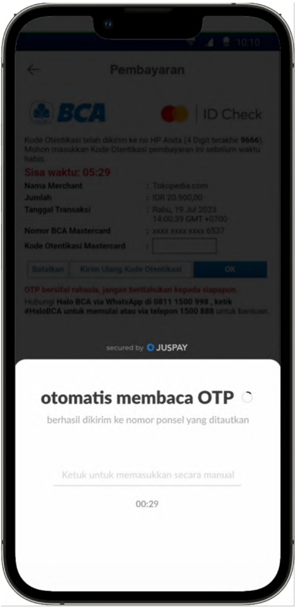

## Page 19

BOOST CONVERSIONS & REDUCE FRAUD

## Adaptive payment flows based on your data & fallback 3DS repeat user

<!-- image -->

Reduce false positives, by skipping FRM for repeat users transacting via the same device.

<!-- image -->

### Figures

**Figure 1**

**Figure 2**

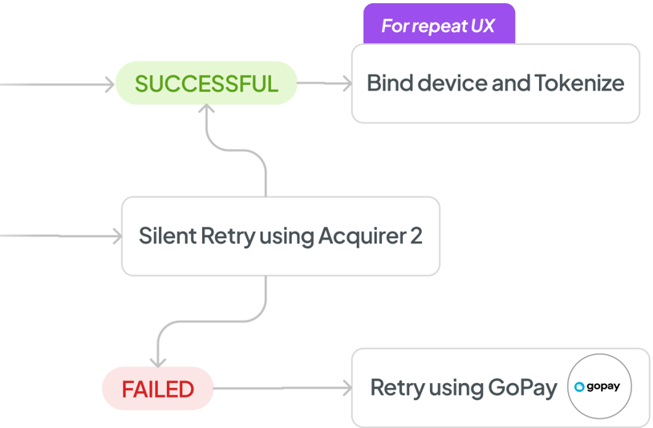

**Figure 3**

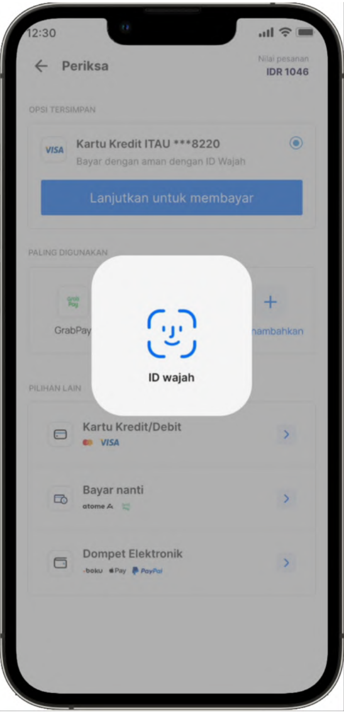

## Page 20

BUILD CUSTOM SOLUTIONS

## Build a custom FRM engine & integrate with other FRM players

Fraud prevention engine tailored by utilising insights from existing customer & payment method data.

Build in-house Trust Score to do customer's risk profile 1

a If user has no chargeback in forthcoming 30 days, increase the score. No FRM for that customer <> card next time.

b If there is chargeback, push for 2FA next time.

2 Have regular velocity checks

<!-- image -->

<!-- image -->

<!-- image -->

<!-- image -->

<!-- image -->

<!-- image -->

<!-- image -->

<!-- image -->

stripe

### Figures

**Figure 1**

**Figure 2**

**Figure 3**

**Figure 4**

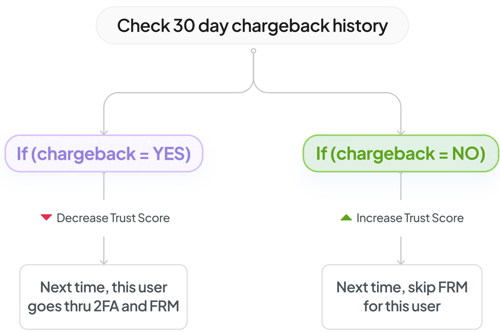

**Figure 5**

**Figure 6**

**Figure 7**

**Figure 8**

**Figure 9**

## Page 21

## EXPAND PAYMENT FLOWS

## Enable recurring payments

## Delayed capture (free cancellation period) 1

<!-- image -->

· Authorize the transaction & block the amount during the transaction journey

· Deduct the money only when the service is delivered (within 7 days)

· Increase the Working capital & save significant processing costs

## 2 One time Mandate (free cancellation period)

· Validate the card & customer by doing a $0 authorization

· Once the booking window is near, invoke the recurring transaction to debit the amount

· Increase the Working capital & save significant processing costs

### Figures

**Figure 1**

**Figure 2**

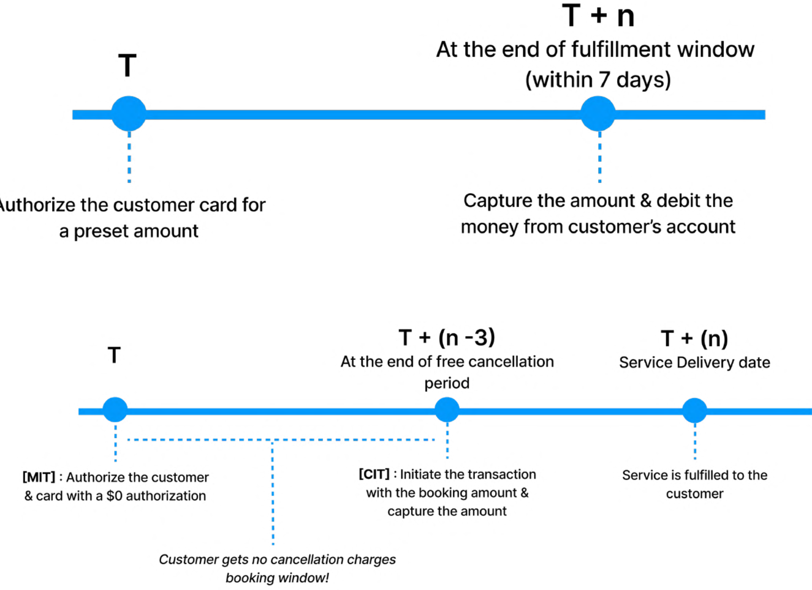

## Page 22

EXPAND PAYMENT FLOWS

## Offer Module to boost loyalty & sales

Configure all types of offers 1

· Offers based on Coupons, Hidden Coupons,

· Auto-apply (No-Coupon), Multi-Coupons, Add-ons etc

2 Multiple offer constructs available

· Instant Discounts or Cashbacks with Payment Locking for Offers

3 Apply validations to solve all use cases

· Eligibility & Validity Checks, Offers for specific Payment Methods, Customers, Time Periods, Products etc

### Figures

**Figure 1**

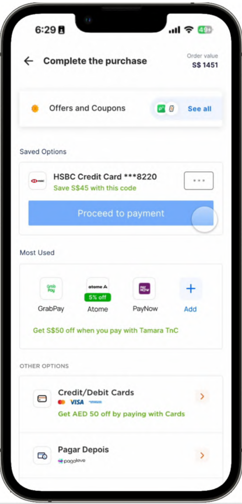

## Page 23

## EXPAND PAYMENT FLOWS

## Enhance checkout experience & Reduce Payment Ops

<!-- image -->

## Manual Retries

Recover failed payments with a dynamic & configurable retry engine

### Figures

**Figure 1**

**Figure 2**

## Page 24

## EXPAND PAYMENT FLOWS

## Enhance checkout experience & Reduce Payment Ops

<!-- image -->

## Manual Retries

Recover failed payments with a dynamic & configurable retry engine

## Quickpay

Complete payment right from the Product/ Order page

### Figures

**Figure 1**

**Figure 2**

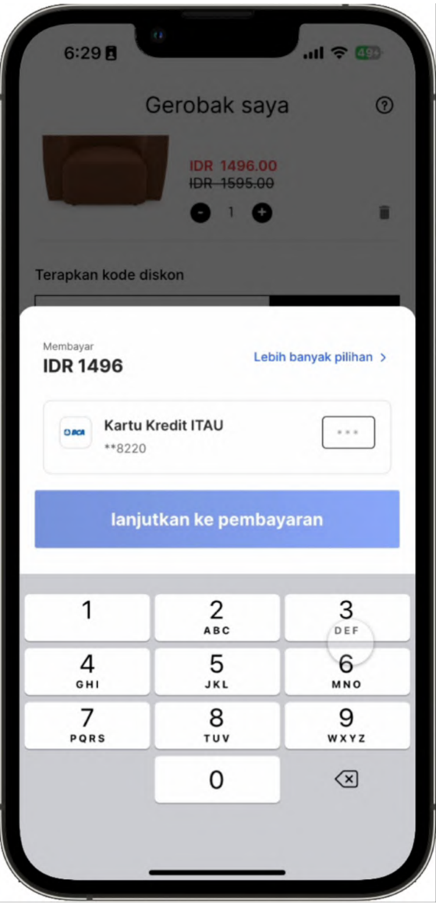

## Page 25

## EXPAND PAYMENT FLOWS

## Enhance checkout experience & Reduce Payment Ops

<!-- image -->

## Manual Retries

Recover failed payments with a dynamic & configurable retry engine

<!-- image -->

## Outage

Real-time alerts in the event of payment downtimes

## Quickpay

Complete payment right from the Product/ Order page

### Figures

**Figure 1**

**Figure 2**

**Figure 3**

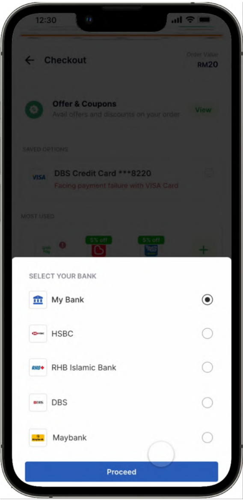

## Page 26

## EXPAND PAYMENT FLOWS

## Enhance checkout experience & Reduce Payment Ops

<!-- image -->

## Manual Retries

Recover failed payments with a dynamic & configurable retry engine

<!-- image -->

## Outage

Real-time alerts in the event of payment downtimes

## Quickpay

Complete payment right from the Product/ Order page

<!-- image -->

## Installments

Increase the affordability by splitting into monthly payments

### Figures

**Figure 1**

**Figure 2**

**Figure 3**

**Figure 4**

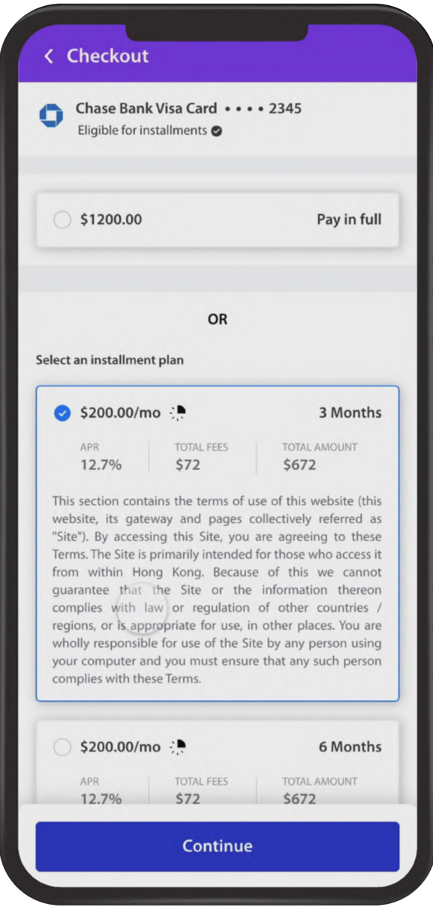

## Page 27

"Untitled"

<!-- image -->

<!-- image -->

BUILD A CHECKOUT EXPERIENCE OF YOUR CHOICE

<!-- image -->

## Unified, Native, and customisable checkout experiences with Juspay Studio

<!-- image -->

<!-- image -->

<!-- image -->

### Figures

**Figure 1**

**Figure 2**

**Figure 3**

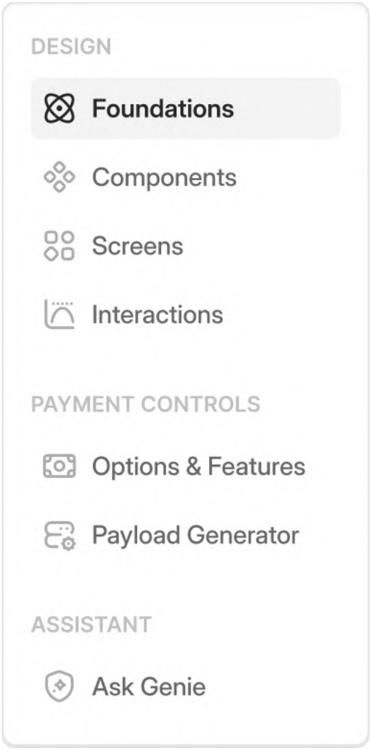

**Figure 4**

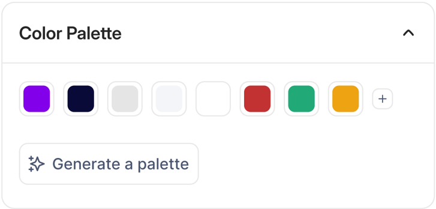

**Figure 5**

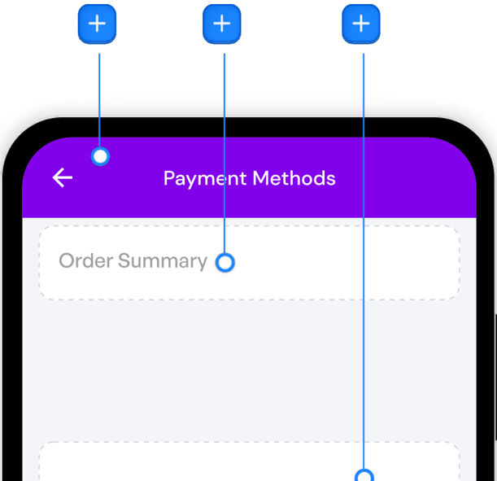

**Figure 6**

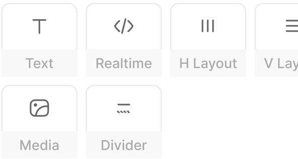

**Figure 7**

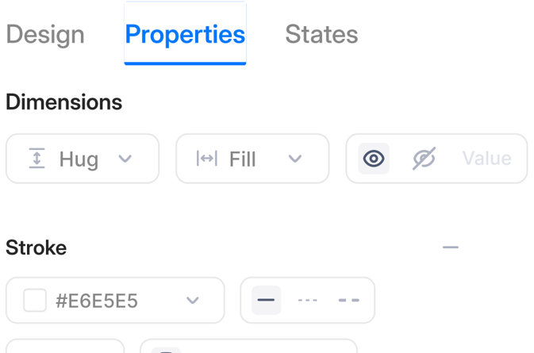

## Page 28

### Figures

**Figure 1**

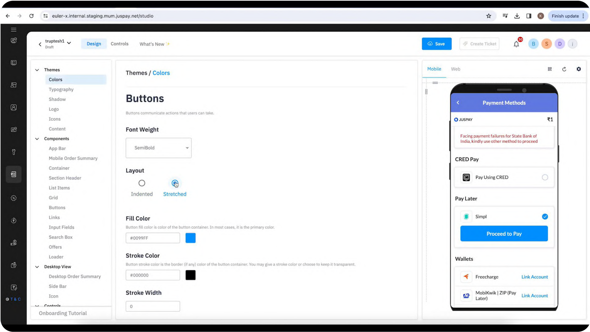

## Page 29

## Page 30

PAYMENTS OBERVABILITY

## Unified Transaction Analytics with custom alerts & reports

Performance of PSPs across multiple dimensions 1

2 Custom alerts & reports

3 Conversion funnel to understand user behaviour

4 Automated performance reports with actionable insights to improve Authorization rates

### Figures

**Figure 1**

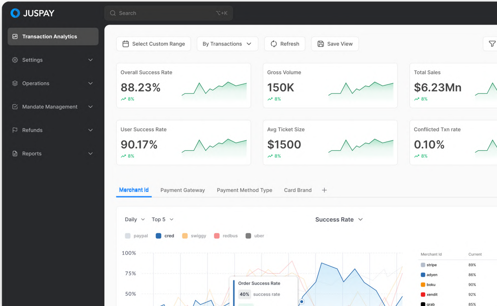

## Page 31

## Get deeper visibility to understand Payment Failures

### Figures

**Figure 1**

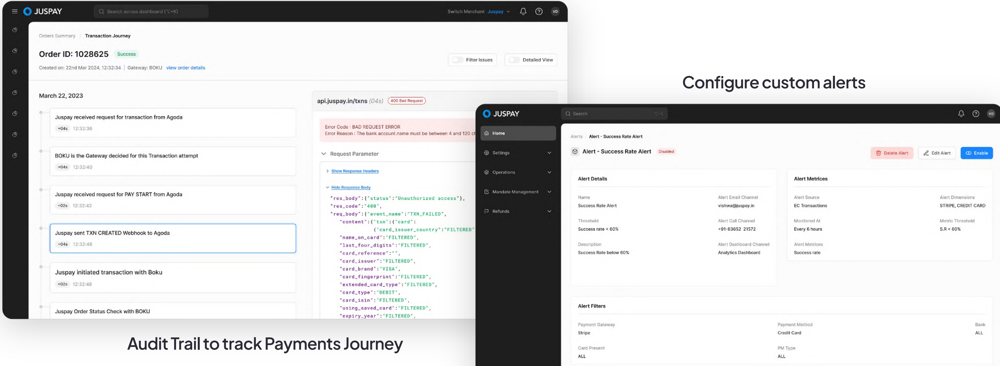

## Page 32

PAYMENTS OBERVABILITY

## Single View for Refunds & Chargebacks

Initiate refunds via APIs, Dashboard or File upload (bulk refunds) 1

2 Track refunds till the time money reaches customer account

3 Unified chargeback information across PSPs

### Figures

**Figure 1**

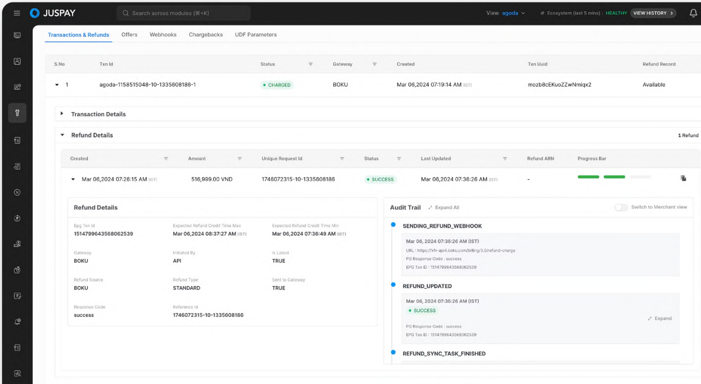

## Page 33

## PAYMENTS OBERVABILITY

## Reconcile transactions across all PSPs & get customized Settlement Report

Multiple options to import Settlement data - APIs, SFTP, Dashboard upload 1

2 Standardized view of settlement data across all PSPs

3 Unified custom settlement report as per your CRM

3 Option of reconciling settlement report with your bank reports or internal payments data

### Figures

**Figure 1**

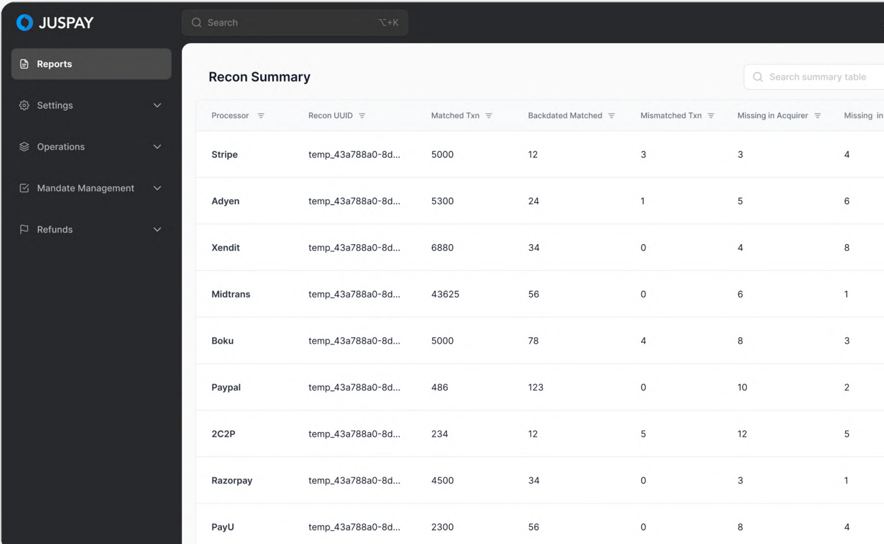

## Page 34

### Figures

**Figure 1**

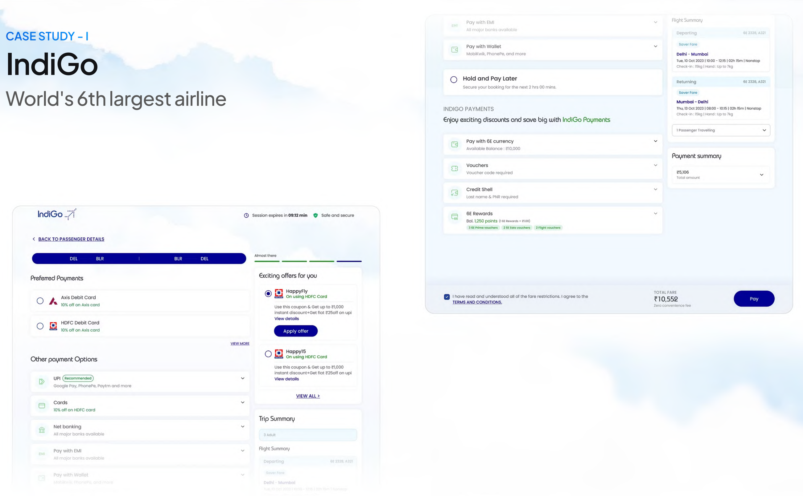

## Page 35

## IndiGo

### Figures

**Figure 1**

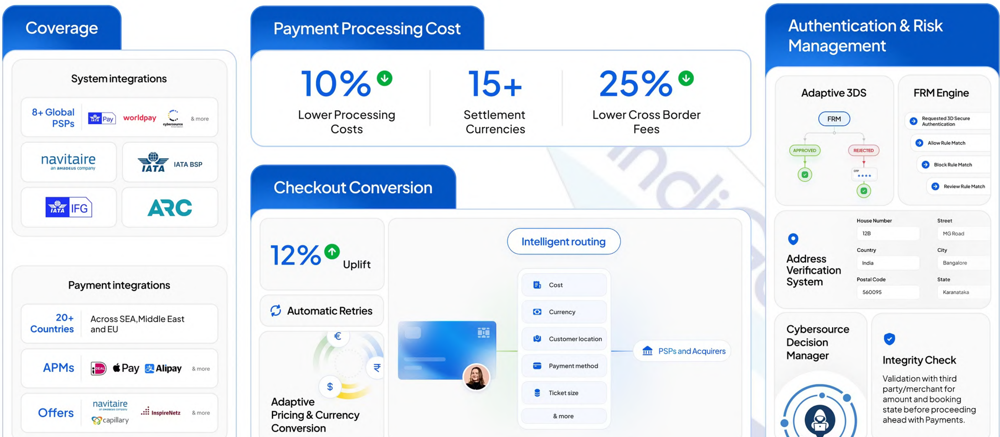

## Page 36

## IndiGo

Reliability

99.999%

ZERO DOWNTIME

during the cloudstrikeoutage

## Simplified Operations

<!-- image -->

<!-- image -->

VISA Installments

VISA

<!-- image -->

### Figures

**Figure 1**

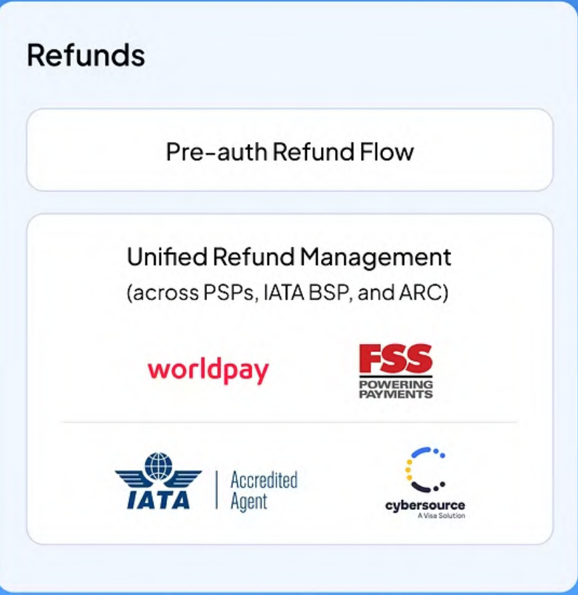

**Figure 2**

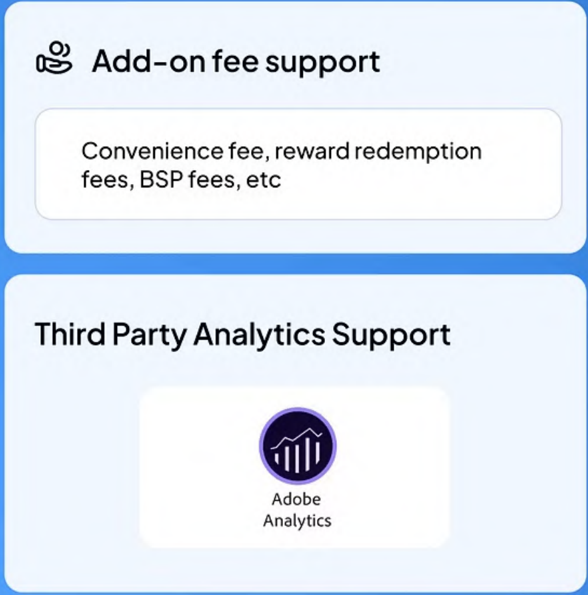

**Figure 3**

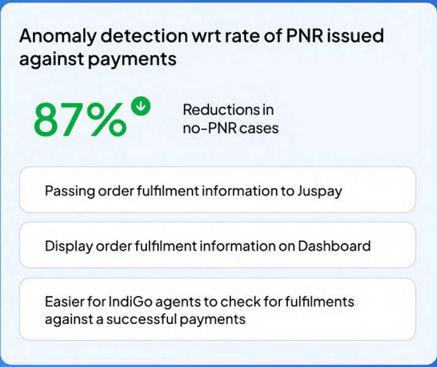

**Figure 4**

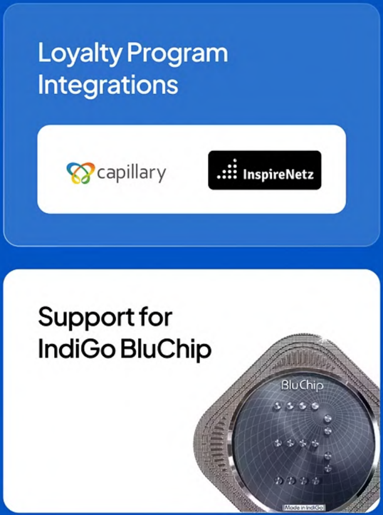

## Page 37

## IndiGo | Offers

### Figures

**Figure 1**

## Page 38

## Unlocking Value by Collaborating Across the Ecosystem

## Fighting fraud with seamless 2FA

### Figures

**Figure 1**

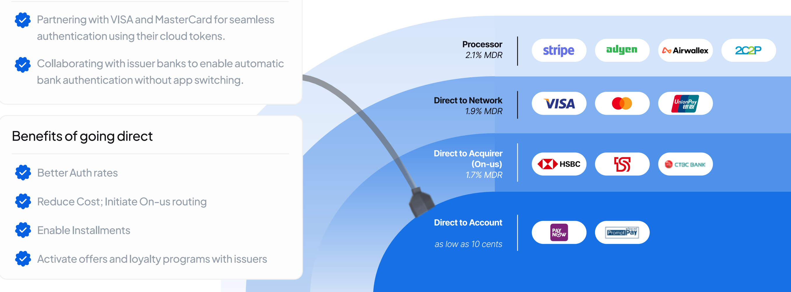

## Page 39

## Engineering excellence to ensure

## 99.999% Uptime, Self healing systems

## Reliability

Service Mesh - Intelligent Retries, Rate-limiters, Circuitbreakers. Towards Active-Active Multi-DC Setup

## Bug-free & Frequent  releases

## Agility

Highly Performant Haskell Stack with < 100 ms PSP

Latency. Automated staggered / AB tested releases.

## 10000 TPS, horizontally scalable architecture

## Scalability

Cloud-compatible - AWS & GCP compatible. Horizontally and Vertically Sharded DBs.

## Digital Mission Control Center

## Visibility

## Page 40

## Innovative Internal Payments Team

## Improve Payment Experience

Customized Checkout Pages, Payment Workflows & Seamless Authentication

## Ensure Zero Downtime

Reliable, Scalable & Highly Performant Payment Stack

<!-- image -->

## Solve for Payment Diversity

Add any number of Gateways/ Payment Methods

## Increase Success Rates

### Figures

**Figure 1**

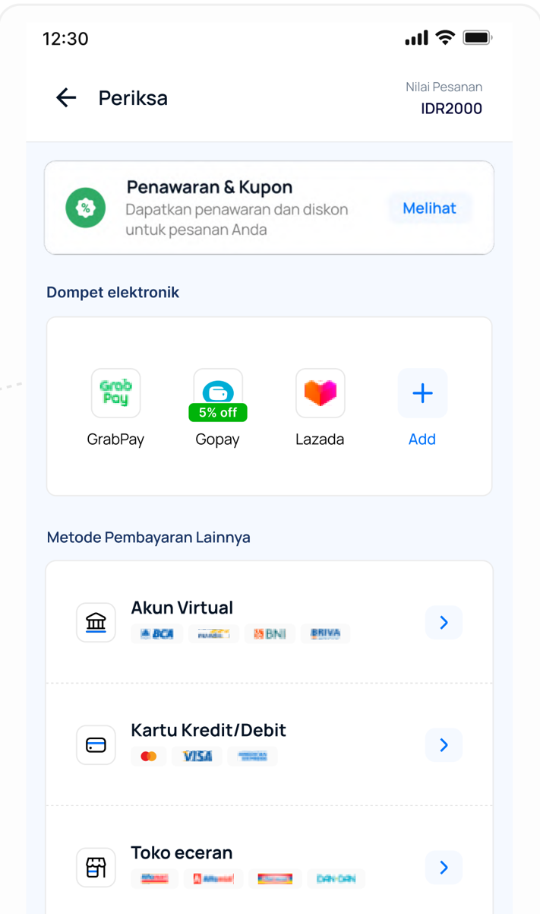

## Page 41

<!-- image -->

## Take your 10× payments journey with us

<!-- image -->

Scan QR to Contact Us global@juspay.in

https://juspay.io

### Figures

**Figure 1**

**Figure 2**

**Figure 3**

