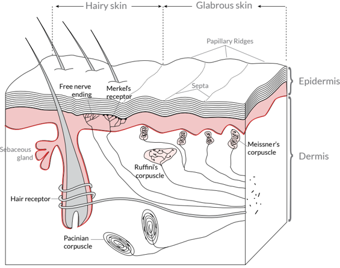
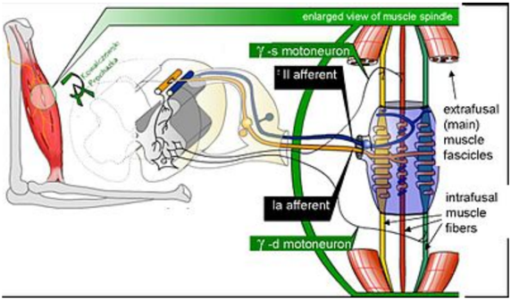
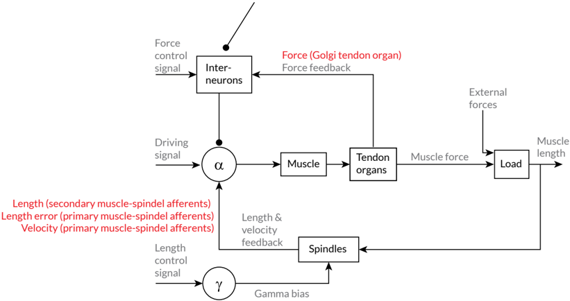

# somatosensory.pdf

_Exported: 2025-09-17 22:36:19_

## Page 1

## Anatomy of the Somatosensory System

FROM WIKIBOOKS 1

Our somatosensory system consists of sensors in the skin and sensors in our muscles, tendons, and joints. The receptors in the skin, the so called cutaneous receptors, tell us about temperature ( thermoreceptors ), pressure and surface  texture  ( mechano  receptors ),  and  pain  ( nociceptors ). The receptors in muscles and joints provide information about muscle length, muscle tension, and joint angles.

## Cutaneous receptors

Sensory information from Meissner corpuscles and rapidly adapting afferents leads to adjustment of grip force when objects  are  lifted.  These  afferents  respond  with  a  brief burst of action potentials when objects move a small distance  during  the  early  stages  of  lifting.  In  response  to

<!-- image -->

This is a sample document to showcase page-based formatting. It contains a chapter from a Wikibook called Sensory Systems. None of the content has been changed in this article, but some content has been removed.

Figure  1: Receptors  in  the  human skin: Mechanoreceptors can be free receptors or encapsulated. Examples  for  free  receptors  are the hair receptors at the roots of hairs. Encapsulated receptors are the  Pacinian  corpuscles  and  the receptors  in  the  glabrous  (hairless)  skin:  Meissner  corpuscles, Ruffini  corpuscles  and  Merkel's disks.

### Figures

**Figure 1**

## Page 2

## From Wikibooks

Figure 2: Mammalian  muscle spindle  showing  typical  position in  a  muscle  (left),  neuronal  connections  in  spinal  cord  (middle) and  expanded  schematic  (right). The spindle is a stretch receptor with  its  own  motor  supply  consisting of several intrafusal muscle fibres. The sensory endings of a primary (group Ia) afferent and a  secondary  (group  II)  afferent coil  around  the  non-contractile central portions of the intrafusal fibres.
<!-- image -->

rapidly adapting afferent activity, muscle force increases reflexively until the gripped object no longer moves. Such a rapid response to a tactile stimulus is a clear indication of the role played by somatosensory neurons in motor activity.

The slowly adapting Merkel's receptors are responsible for form and texture perception. As would be expected for receptors  mediating  form  perception,  Merkel's  receptors are present at high density in the digits and around the mouth (50/mm² of skin surface), at lower density in other glabrous surfaces, and at very low density in hairy skin. This  innervations  density  shrinks  progressively  with  the passage of time so that by the age of 50, the density in human digits is reduced to 10/mm². Unlike rapidly adapting axons, slowly adapting fibers respond not only to the initial indentation of skin, but also to sustained indentation up to several seconds in duration.

Activation of the rapidly adapting Pacinian corpuscles gives  a  feeling  of  vibration,  while  the  slowly  adapting Ruffini  corpuscles respond  to  the  lataral  movement  or stretching of skin.

## Nociceptors

### Figures

**Figure 1**

## Page 3

Table 1

|                                          | Rapidly adapting                                                                                                  | Slowly adapting                                                                              |
|------------------------------------------|-------------------------------------------------------------------------------------------------------------------|----------------------------------------------------------------------------------------------|
| Surface receptor / small receptive field | Hair receptor , Meissner's corpuscle : De- tect an insect or a very fine vibration. Used for recognizing texture. | Merkel's receptor: Used for spa- tial details, e.g. a round surface edge or 'an X' in brail. |
| Deep receptor / large receptive field    | Pacinian corpuscle : 'A diffuse vibra- tion' e.g. tapping with a pencil.                                          | Ruffini's corpuscle : 'A skin stretch'. Used for joint position in fingers.                  |

only to intense mechanical stimuli, but also to heat and to noxious chemicals. These receptors respond to minute punctures of the epithelium, with a response magnitude that depends on the degree of tissue deformation. They also respond to temperatures in the range of 40-60°C, and change their response rates as a linear function of warming (in contrast with the saturating responses displayed by non-noxious thermoreceptors at high temperatures).

Pain signals can be separated into individual components,  corresponding  to  different  types  of  nerve  fibers used for transmitting these signals. The rapidly transmitted  signal,  which  often  has  high  spatial  resolution,  is called first pain or cutaneous pricking pain . It is well localized and easily tolerated. The much slower, highly affective component is called second pain or burning pain ; it is poorly  localized  and  poorly  tolerated.  The  third  or deep pain , arising from viscera, musculature and joints, is also poorly  localized,  can  be  chronic  and  is  often  associated with referred pain.

## Muscle Spindles

Scattered throughout virtually every striated muscle in the body are long, thin, stretch receptors called muscle spindles. They are quite simple in principle, consisting of a few small muscle fibers with a capsule surrounding the middle third of the fibers. These fibers are called intrafusal fibers , in contrast to the ordinary extrafusal fibers . The ends of the intrafusal fibers are attached to extrafusal fibers, so whenever the muscle is stretched, the intrafusal fibers are also stretched. The central region of each intrafusal fiber has

## Page 4

## From Wikibooks

Figure 3: Feedback loops for proprioceptive signals for the perception and control of limb movements. Arrows indicate excitatory connections; filled circles inhibitory connections.
<!-- image -->

few myofilaments and is non-contractile, but it does have one or more sensory endings applied to it. When the muscle is stretched, the central part of the intrafusal fiber is stretched and each sensory ending fires impulses.

Muscle spindles also receive a motor innervation. The large motor neurons that supply extrafusal muscle fibers are called alpha motor neurons , while the smaller ones supplying  the  contractile  portions  of  intrafusal  fibers  are called gamma neurons .  Gamma motor neurons can regulate the sensitivity of the muscle spindle so that this sensitivity can be maintained at any given muscle length.

## Joint receptors

The joint  receptors  are  low-threshold  mechanoreceptors and have been divided into four groups. They signal different characteristics of joint function (position, movements, direction and speed of movements). The free receptors or type 4 joint receptors are nociceptors.

### Figures

**Figure 1**

